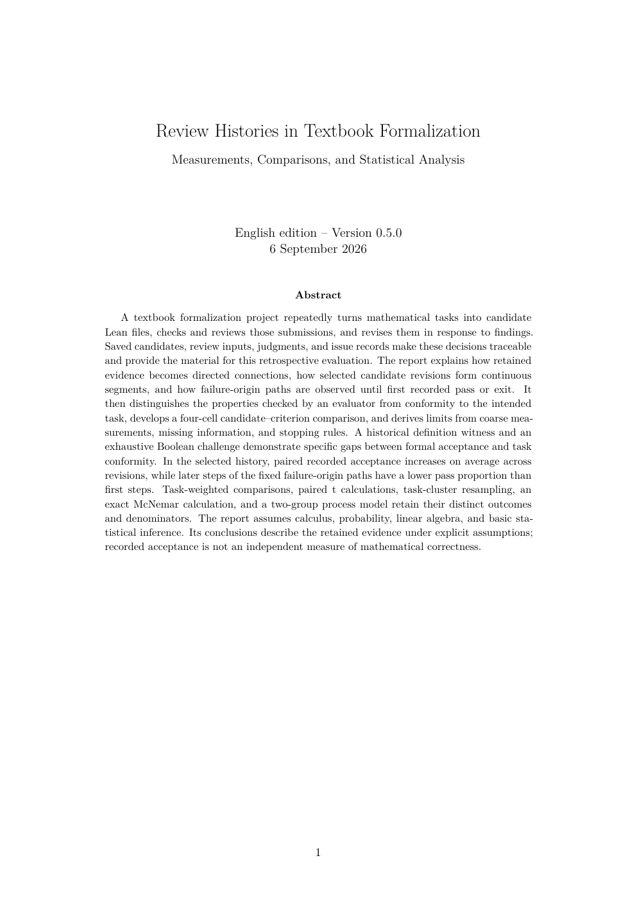

# PDF page 1



## Extracted text

```text
           Review Histories in Textbook Formalization
              Measurements, Comparisons, and Statistical Analysis


                            English edition – Version 0.5.0
                                  6 September 2026


                                          Abstract

    A textbook formalization project repeatedly turns mathematical tasks into candidate
Lean files, checks and reviews those submissions, and revises them in response to findings.
Saved candidates, review inputs, judgments, and issue records make these decisions traceable
and provide the material for this retrospective evaluation. The report explains how retained
evidence becomes directed connections, how selected candidate revisions form continuous
segments, and how failure-origin paths are observed until first recorded pass or exit. It
then distinguishes the properties checked by an evaluator from conformity to the intended
task, develops a four-cell candidate–criterion comparison, and derives limits from coarse mea-
surements, missing information, and stopping rules. A historical definition witness and an
exhaustive Boolean challenge demonstrate specific gaps between formal acceptance and task
conformity. In the selected history, paired recorded acceptance increases on average across
revisions, while later steps of the fixed failure-origin paths have a lower pass proportion than
first steps. Task-weighted comparisons, paired t calculations, task-cluster resampling, an
exact McNemar calculation, and a two-group process model retain their distinct outcomes
and denominators. The report assumes calculus, probability, linear algebra, and basic sta-
tistical inference. Its conclusions describe the retained evidence under explicit assumptions;
recorded acceptance is not an independent measure of mathematical correctness.


                                              1
```
