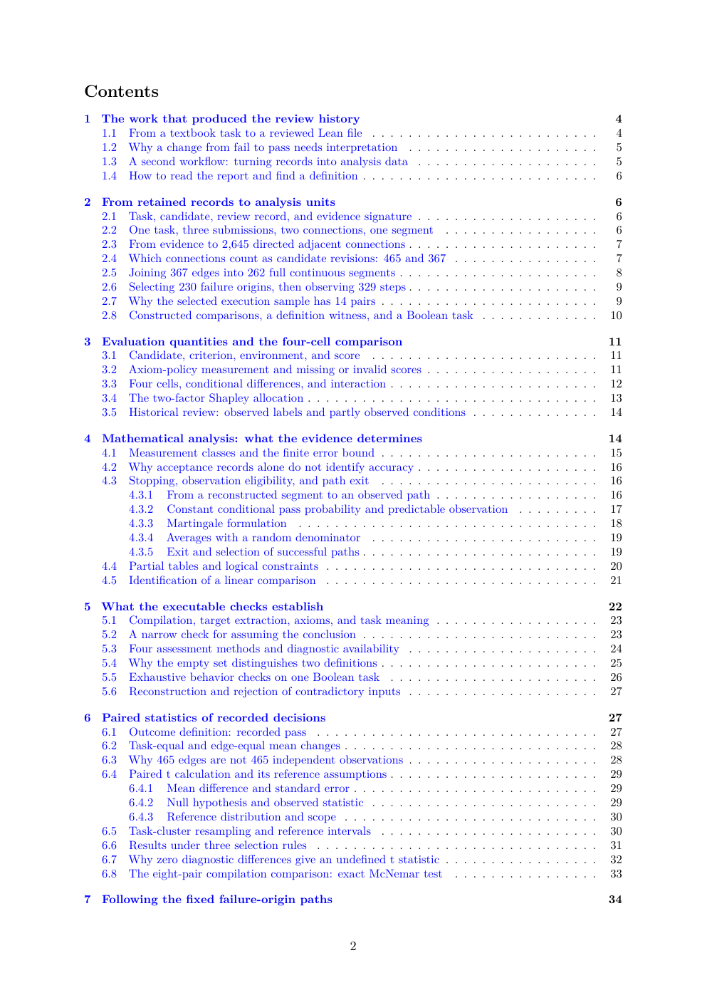

# PDF page 2



## Extracted text

```text
Contents
1 The work that produced the review history                                                                 4
  1.1 From a textbook task to a reviewed Lean file . . . . . . . . . . . . . . . . . . . . . . . . .         4
  1.2 Why a change from fail to pass needs interpretation . . . . . . . . . . . . . . . . . . . . .         5
  1.3 A second workflow: turning records into analysis data . . . . . . . . . . . . . . . . . . . .          5
  1.4 How to read the report and find a definition . . . . . . . . . . . . . . . . . . . . . . . . . .        6

2 From retained records to analysis units                                                                   6
  2.1 Task, candidate, review record, and evidence signature . . . . . . . . . . . . . . . . . . . .        6
  2.2 One task, three submissions, two connections, one segment . . . . . . . . . . . . . . . . .           6
  2.3 From evidence to 2,645 directed adjacent connections . . . . . . . . . . . . . . . . . . . . .        7
  2.4 Which connections count as candidate revisions: 465 and 367 . . . . . . . . . . . . . . . .           7
  2.5 Joining 367 edges into 262 full continuous segments . . . . . . . . . . . . . . . . . . . . . .       8
  2.6 Selecting 230 failure origins, then observing 329 steps . . . . . . . . . . . . . . . . . . . . .     9
  2.7 Why the selected execution sample has 14 pairs . . . . . . . . . . . . . . . . . . . . . . . .        9
  2.8 Constructed comparisons, a definition witness, and a Boolean task . . . . . . . . . . . . .           10

3 Evaluation quantities and the four-cell comparison                                                       11
  3.1 Candidate, criterion, environment, and score . . . . . . . . . . . . . . . . . . . . . . . . .       11
  3.2 Axiom-policy measurement and missing or invalid scores . . . . . . . . . . . . . . . . . . .         11
  3.3 Four cells, conditional differences, and interaction . . . . . . . . . . . . . . . . . . . . . . .    12
  3.4 The two-factor Shapley allocation . . . . . . . . . . . . . . . . . . . . . . . . . . . . . . . .    13
  3.5 Historical review: observed labels and partly observed conditions . . . . . . . . . . . . . .        14

4 Mathematical analysis: what the evidence determines                                                      14
  4.1 Measurement classes and the finite error bound . . . . . . . . . . . . . . . . . . . . . . . .        15
  4.2 Why acceptance records alone do not identify accuracy . . . . . . . . . . . . . . . . . . . .        16
  4.3 Stopping, observation eligibility, and path exit . . . . . . . . . . . . . . . . . . . . . . . .     16
      4.3.1 From a reconstructed segment to an observed path . . . . . . . . . . . . . . . . . .           16
      4.3.2 Constant conditional pass probability and predictable observation . . . . . . . . .            17
      4.3.3 Martingale formulation . . . . . . . . . . . . . . . . . . . . . . . . . . . . . . . . .       18
      4.3.4 Averages with a random denominator . . . . . . . . . . . . . . . . . . . . . . . . .           19
      4.3.5 Exit and selection of successful paths . . . . . . . . . . . . . . . . . . . . . . . . . .     19
  4.4 Partial tables and logical constraints . . . . . . . . . . . . . . . . . . . . . . . . . . . . . .   20
  4.5 Identification of a linear comparison . . . . . . . . . . . . . . . . . . . . . . . . . . . . . .     21

5 What the executable checks establish                                                                     22
  5.1 Compilation, target extraction, axioms, and task meaning . . . . . . . . . . . . . . . . . .         23
  5.2 A narrow check for assuming the conclusion . . . . . . . . . . . . . . . . . . . . . . . . . .       23
  5.3 Four assessment methods and diagnostic availability . . . . . . . . . . . . . . . . . . . . .        24
  5.4 Why the empty set distinguishes two definitions . . . . . . . . . . . . . . . . . . . . . . . .       25
  5.5 Exhaustive behavior checks on one Boolean task . . . . . . . . . . . . . . . . . . . . . . .         26
  5.6 Reconstruction and rejection of contradictory inputs . . . . . . . . . . . . . . . . . . . . .       27

6 Paired statistics of recorded decisions                                                                  27
  6.1 Outcome definition: recorded pass . . . . . . . . . . . . . . . . . . . . . . . . . . . . . . .       27
  6.2 Task-equal and edge-equal mean changes . . . . . . . . . . . . . . . . . . . . . . . . . . . .       28
  6.3 Why 465 edges are not 465 independent observations . . . . . . . . . . . . . . . . . . . . .         28
  6.4 Paired t calculation and its reference assumptions . . . . . . . . . . . . . . . . . . . . . . .     29
      6.4.1 Mean difference and standard error . . . . . . . . . . . . . . . . . . . . . . . . . . .        29
      6.4.2 Null hypothesis and observed statistic . . . . . . . . . . . . . . . . . . . . . . . . .       29
      6.4.3 Reference distribution and scope . . . . . . . . . . . . . . . . . . . . . . . . . . . .       30
  6.5 Task-cluster resampling and reference intervals . . . . . . . . . . . . . . . . . . . . . . . .      30
  6.6 Results under three selection rules . . . . . . . . . . . . . . . . . . . . . . . . . . . . . . .    31
  6.7 Why zero diagnostic differences give an undefined t statistic . . . . . . . . . . . . . . . . .        32
  6.8 The eight-pair compilation comparison: exact McNemar test . . . . . . . . . . . . . . . .            33

7 Following the fixed failure-origin paths                                                                  34


                                                      2
```
