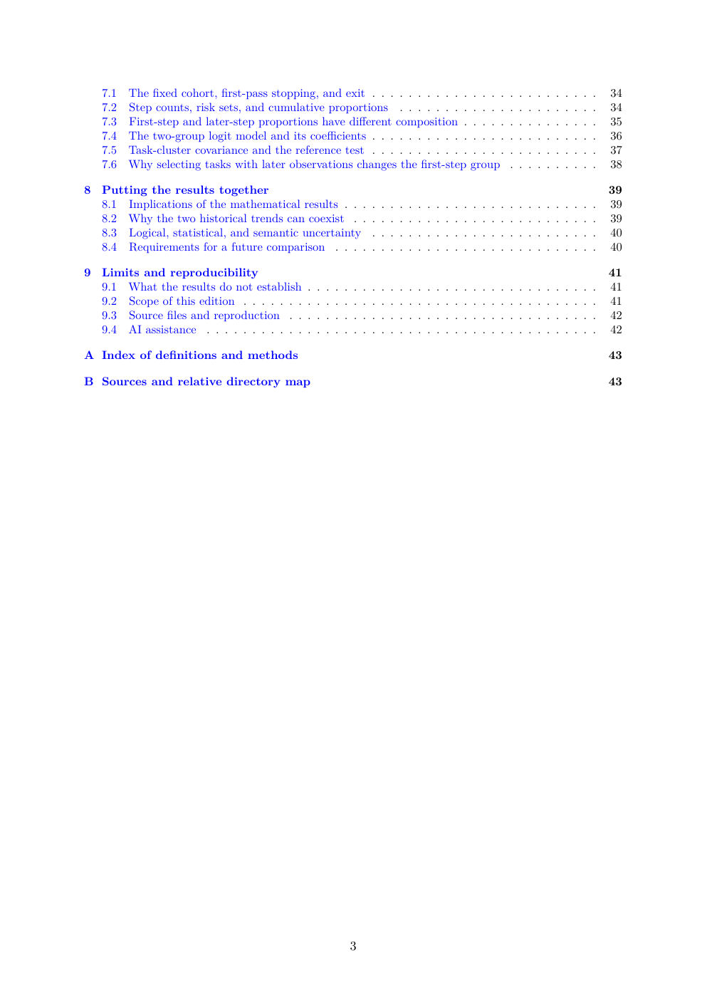

# PDF page 3



## Extracted text

```text
   7.1   The fixed cohort, first-pass stopping, and exit . . . . . . . . . . . . . . . . . . . . . . . . .    34
   7.2   Step counts, risk sets, and cumulative proportions . . . . . . . . . . . . . . . . . . . . . .     34
   7.3   First-step and later-step proportions have different composition . . . . . . . . . . . . . . .      35
   7.4   The two-group logit model and its coefficients . . . . . . . . . . . . . . . . . . . . . . . . .     36
   7.5   Task-cluster covariance and the reference test . . . . . . . . . . . . . . . . . . . . . . . . .   37
   7.6   Why selecting tasks with later observations changes the first-step group . . . . . . . . . .        38

8 Putting the results together                                                                              39
  8.1 Implications of the mathematical results . . . . . . . . . . . . . . . . . . . . . . . . . . . .      39
  8.2 Why the two historical trends can coexist . . . . . . . . . . . . . . . . . . . . . . . . . . .       39
  8.3 Logical, statistical, and semantic uncertainty . . . . . . . . . . . . . . . . . . . . . . . . .      40
  8.4 Requirements for a future comparison . . . . . . . . . . . . . . . . . . . . . . . . . . . . .        40

9 Limits and reproducibility                                                                                41
  9.1 What the results do not establish . . . . . . . . . . . . . . . . . . . . . . . . . . . . . . . .     41
  9.2 Scope of this edition . . . . . . . . . . . . . . . . . . . . . . . . . . . . . . . . . . . . . . .   41
  9.3 Source files and reproduction . . . . . . . . . . . . . . . . . . . . . . . . . . . . . . . . . .      42
  9.4 AI assistance . . . . . . . . . . . . . . . . . . . . . . . . . . . . . . . . . . . . . . . . . . .   42

A Index of definitions and methods                                                                           43

B Sources and relative directory map                                                                        43


                                                      3
```
