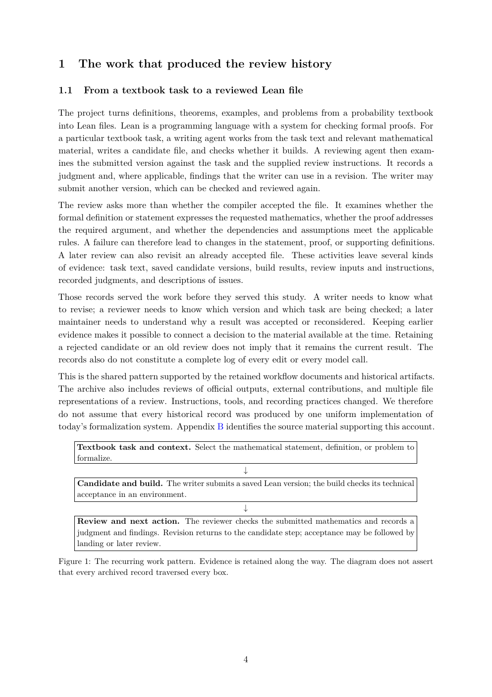

# PDF page 4



## Extracted text

```text
1     The work that produced the review history

1.1    From a textbook task to a reviewed Lean file

The project turns definitions, theorems, examples, and problems from a probability textbook
into Lean files. Lean is a programming language with a system for checking formal proofs. For
a particular textbook task, a writing agent works from the task text and relevant mathematical
material, writes a candidate file, and checks whether it builds. A reviewing agent then exam-
ines the submitted version against the task and the supplied review instructions. It records a
judgment and, where applicable, findings that the writer can use in a revision. The writer may
submit another version, which can be checked and reviewed again.
The review asks more than whether the compiler accepted the file. It examines whether the
formal definition or statement expresses the requested mathematics, whether the proof addresses
the required argument, and whether the dependencies and assumptions meet the applicable
rules. A failure can therefore lead to changes in the statement, proof, or supporting definitions.
A later review can also revisit an already accepted file. These activities leave several kinds
of evidence: task text, saved candidate versions, build results, review inputs and instructions,
recorded judgments, and descriptions of issues.
Those records served the work before they served this study. A writer needs to know what
to revise; a reviewer needs to know which version and which task are being checked; a later
maintainer needs to understand why a result was accepted or reconsidered. Keeping earlier
evidence makes it possible to connect a decision to the material available at the time. Retaining
a rejected candidate or an old review does not imply that it remains the current result. The
records also do not constitute a complete log of every edit or every model call.
This is the shared pattern supported by the retained workflow documents and historical artifacts.
The archive also includes reviews of official outputs, external contributions, and multiple file
representations of a review. Instructions, tools, and recording practices changed. We therefore
do not assume that every historical record was produced by one uniform implementation of
today’s formalization system. Appendix B identifies the source material supporting this account.

      Textbook task and context. Select the mathematical statement, definition, or problem to
      formalize.
                                              ↓
      Candidate and build. The writer submits a saved Lean version; the build checks its technical
      acceptance in an environment.
                                                   ↓
      Review and next action. The reviewer checks the submitted mathematics and records a
      judgment and findings. Revision returns to the candidate step; acceptance may be followed by
      landing or later review.

Figure 1: The recurring work pattern. Evidence is retained along the way. The diagram does not assert
that every archived record traversed every box.


                                                   4
```
