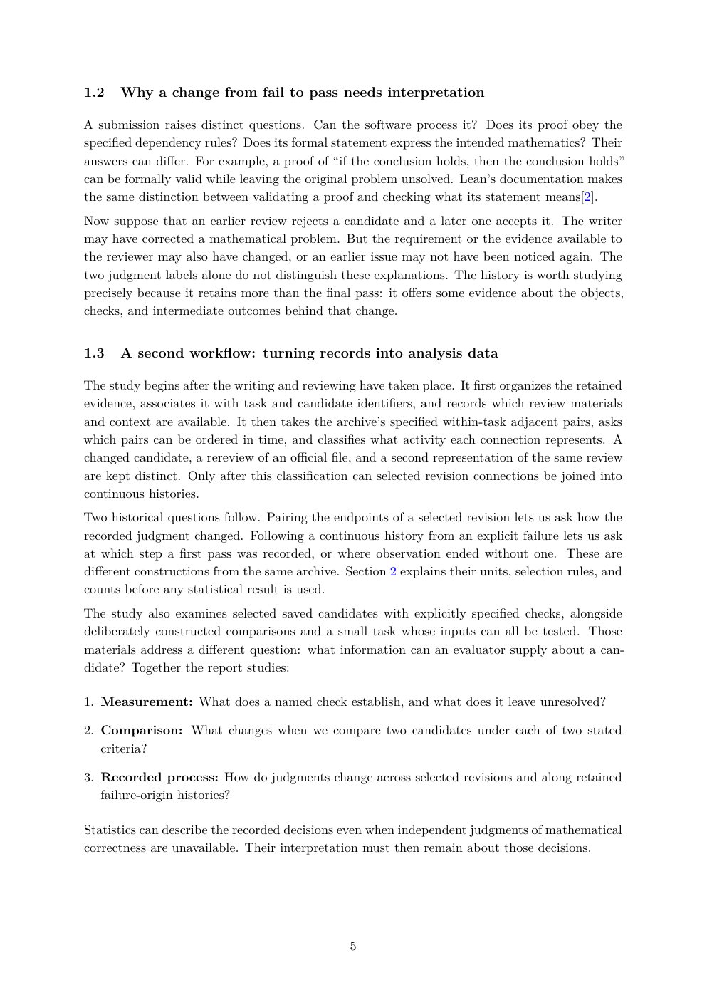

# PDF page 5



## Extracted text

```text
1.2   Why a change from fail to pass needs interpretation

A submission raises distinct questions. Can the software process it? Does its proof obey the
specified dependency rules? Does its formal statement express the intended mathematics? Their
answers can differ. For example, a proof of “if the conclusion holds, then the conclusion holds”
can be formally valid while leaving the original problem unsolved. Lean’s documentation makes
the same distinction between validating a proof and checking what its statement means[2].
Now suppose that an earlier review rejects a candidate and a later one accepts it. The writer
may have corrected a mathematical problem. But the requirement or the evidence available to
the reviewer may also have changed, or an earlier issue may not have been noticed again. The
two judgment labels alone do not distinguish these explanations. The history is worth studying
precisely because it retains more than the final pass: it offers some evidence about the objects,
checks, and intermediate outcomes behind that change.


1.3   A second workflow: turning records into analysis data

The study begins after the writing and reviewing have taken place. It first organizes the retained
evidence, associates it with task and candidate identifiers, and records which review materials
and context are available. It then takes the archive’s specified within-task adjacent pairs, asks
which pairs can be ordered in time, and classifies what activity each connection represents. A
changed candidate, a rereview of an official file, and a second representation of the same review
are kept distinct. Only after this classification can selected revision connections be joined into
continuous histories.
Two historical questions follow. Pairing the endpoints of a selected revision lets us ask how the
recorded judgment changed. Following a continuous history from an explicit failure lets us ask
at which step a first pass was recorded, or where observation ended without one. These are
different constructions from the same archive. Section 2 explains their units, selection rules, and
counts before any statistical result is used.
The study also examines selected saved candidates with explicitly specified checks, alongside
deliberately constructed comparisons and a small task whose inputs can all be tested. Those
materials address a different question: what information can an evaluator supply about a can-
didate? Together the report studies:

1. Measurement: What does a named check establish, and what does it leave unresolved?

2. Comparison: What changes when we compare two candidates under each of two stated
   criteria?

3. Recorded process: How do judgments change across selected revisions and along retained
   failure-origin histories?

Statistics can describe the recorded decisions even when independent judgments of mathematical
correctness are unavailable. Their interpretation must then remain about those decisions.


                                                5
```
