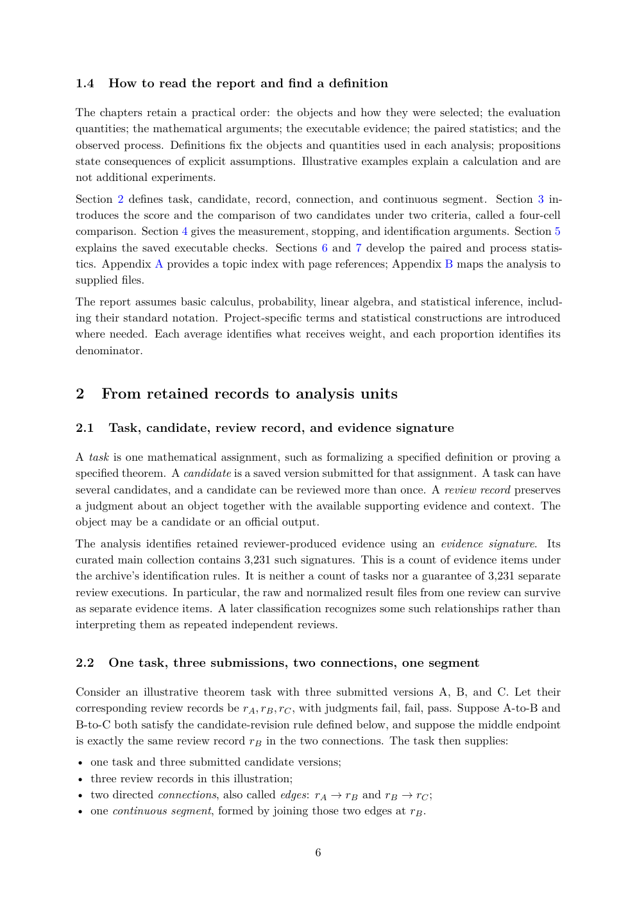

# PDF page 6



## Extracted text

```text
1.4   How to read the report and find a definition

The chapters retain a practical order: the objects and how they were selected; the evaluation
quantities; the mathematical arguments; the executable evidence; the paired statistics; and the
observed process. Definitions fix the objects and quantities used in each analysis; propositions
state consequences of explicit assumptions. Illustrative examples explain a calculation and are
not additional experiments.
Section 2 defines task, candidate, record, connection, and continuous segment. Section 3 in-
troduces the score and the comparison of two candidates under two criteria, called a four-cell
comparison. Section 4 gives the measurement, stopping, and identification arguments. Section 5
explains the saved executable checks. Sections 6 and 7 develop the paired and process statis-
tics. Appendix A provides a topic index with page references; Appendix B maps the analysis to
supplied files.
The report assumes basic calculus, probability, linear algebra, and statistical inference, includ-
ing their standard notation. Project-specific terms and statistical constructions are introduced
where needed. Each average identifies what receives weight, and each proportion identifies its
denominator.


2     From retained records to analysis units

2.1   Task, candidate, review record, and evidence signature

A task is one mathematical assignment, such as formalizing a specified definition or proving a
specified theorem. A candidate is a saved version submitted for that assignment. A task can have
several candidates, and a candidate can be reviewed more than once. A review record preserves
a judgment about an object together with the available supporting evidence and context. The
object may be a candidate or an official output.
The analysis identifies retained reviewer-produced evidence using an evidence signature. Its
curated main collection contains 3,231 such signatures. This is a count of evidence items under
the archive’s identification rules. It is neither a count of tasks nor a guarantee of 3,231 separate
review executions. In particular, the raw and normalized result files from one review can survive
as separate evidence items. A later classification recognizes some such relationships rather than
interpreting them as repeated independent reviews.


2.2   One task, three submissions, two connections, one segment

Consider an illustrative theorem task with three submitted versions A, B, and C. Let their
corresponding review records be rA , rB , rC , with judgments fail, fail, pass. Suppose A-to-B and
B-to-C both satisfy the candidate-revision rule defined below, and suppose the middle endpoint
is exactly the same review record rB in the two connections. The task then supplies:
• one task and three submitted candidate versions;
• three review records in this illustration;
• two directed connections, also called edges: rA → rB and rB → rC ;
• one continuous segment, formed by joining those two edges at rB .


                                                6
```
