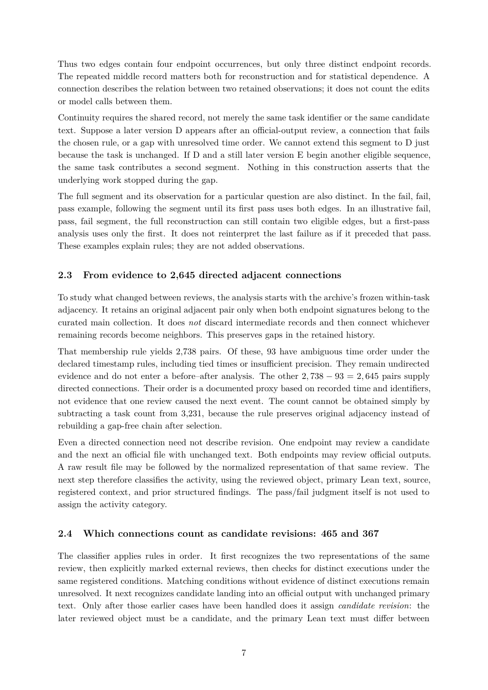

# PDF page 7



## Extracted text

```text
Thus two edges contain four endpoint occurrences, but only three distinct endpoint records.
The repeated middle record matters both for reconstruction and for statistical dependence. A
connection describes the relation between two retained observations; it does not count the edits
or model calls between them.
Continuity requires the shared record, not merely the same task identifier or the same candidate
text. Suppose a later version D appears after an official-output review, a connection that fails
the chosen rule, or a gap with unresolved time order. We cannot extend this segment to D just
because the task is unchanged. If D and a still later version E begin another eligible sequence,
the same task contributes a second segment. Nothing in this construction asserts that the
underlying work stopped during the gap.
The full segment and its observation for a particular question are also distinct. In the fail, fail,
pass example, following the segment until its first pass uses both edges. In an illustrative fail,
pass, fail segment, the full reconstruction can still contain two eligible edges, but a first-pass
analysis uses only the first. It does not reinterpret the last failure as if it preceded that pass.
These examples explain rules; they are not added observations.


2.3   From evidence to 2,645 directed adjacent connections

To study what changed between reviews, the analysis starts with the archive’s frozen within-task
adjacency. It retains an original adjacent pair only when both endpoint signatures belong to the
curated main collection. It does not discard intermediate records and then connect whichever
remaining records become neighbors. This preserves gaps in the retained history.
That membership rule yields 2,738 pairs. Of these, 93 have ambiguous time order under the
declared timestamp rules, including tied times or insufficient precision. They remain undirected
evidence and do not enter a before–after analysis. The other 2, 738 − 93 = 2, 645 pairs supply
directed connections. Their order is a documented proxy based on recorded time and identifiers,
not evidence that one review caused the next event. The count cannot be obtained simply by
subtracting a task count from 3,231, because the rule preserves original adjacency instead of
rebuilding a gap-free chain after selection.
Even a directed connection need not describe revision. One endpoint may review a candidate
and the next an official file with unchanged text. Both endpoints may review official outputs.
A raw result file may be followed by the normalized representation of that same review. The
next step therefore classifies the activity, using the reviewed object, primary Lean text, source,
registered context, and prior structured findings. The pass/fail judgment itself is not used to
assign the activity category.


2.4   Which connections count as candidate revisions: 465 and 367

The classifier applies rules in order. It first recognizes the two representations of the same
review, then explicitly marked external reviews, then checks for distinct executions under the
same registered conditions. Matching conditions without evidence of distinct executions remain
unresolved. It next recognizes candidate landing into an official output with unchanged primary
text. Only after those earlier cases have been handled does it assign candidate revision: the
later reviewed object must be a candidate, and the primary Lean text must differ between


                                                 7
```
