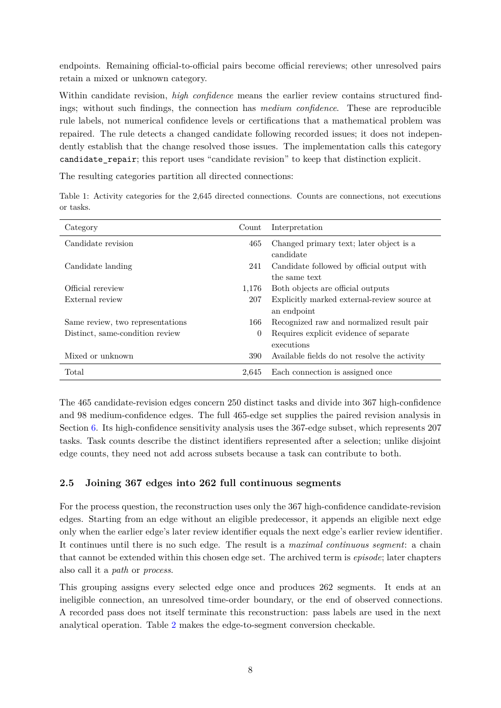

# PDF page 8



## Extracted text

```text
endpoints. Remaining official-to-official pairs become official rereviews; other unresolved pairs
retain a mixed or unknown category.
Within candidate revision, high confidence means the earlier review contains structured find-
ings; without such findings, the connection has medium confidence. These are reproducible
rule labels, not numerical confidence levels or certifications that a mathematical problem was
repaired. The rule detects a changed candidate following recorded issues; it does not indepen-
dently establish that the change resolved those issues. The implementation calls this category
candidate_repair; this report uses “candidate revision” to keep that distinction explicit.
The resulting categories partition all directed connections:

Table 1: Activity categories for the 2,645 directed connections. Counts are connections, not executions
or tasks.

 Category                                       Count    Interpretation
 Candidate revision                                465   Changed primary text; later object is a
                                                         candidate
 Candidate landing                                 241   Candidate followed by official output with
                                                         the same text
 Official rereview                                 1,176   Both objects are official outputs
 External review                                   207   Explicitly marked external-review source at
                                                         an endpoint
 Same review, two representations                  166   Recognized raw and normalized result pair
 Distinct, same-condition review                     0   Requires explicit evidence of separate
                                                         executions
 Mixed or unknown                                  390   Available fields do not resolve the activity
 Total                                           2,645   Each connection is assigned once


The 465 candidate-revision edges concern 250 distinct tasks and divide into 367 high-confidence
and 98 medium-confidence edges. The full 465-edge set supplies the paired revision analysis in
Section 6. Its high-confidence sensitivity analysis uses the 367-edge subset, which represents 207
tasks. Task counts describe the distinct identifiers represented after a selection; unlike disjoint
edge counts, they need not add across subsets because a task can contribute to both.


2.5      Joining 367 edges into 262 full continuous segments

For the process question, the reconstruction uses only the 367 high-confidence candidate-revision
edges. Starting from an edge without an eligible predecessor, it appends an eligible next edge
only when the earlier edge’s later review identifier equals the next edge’s earlier review identifier.
It continues until there is no such edge. The result is a maximal continuous segment: a chain
that cannot be extended within this chosen edge set. The archived term is episode; later chapters
also call it a path or process.
This grouping assigns every selected edge once and produces 262 segments. It ends at an
ineligible connection, an unresolved time-order boundary, or the end of observed connections.
A recorded pass does not itself terminate this reconstruction: pass labels are used in the next
analytical operation. Table 2 makes the edge-to-segment conversion checkable.


                                                  8
```
