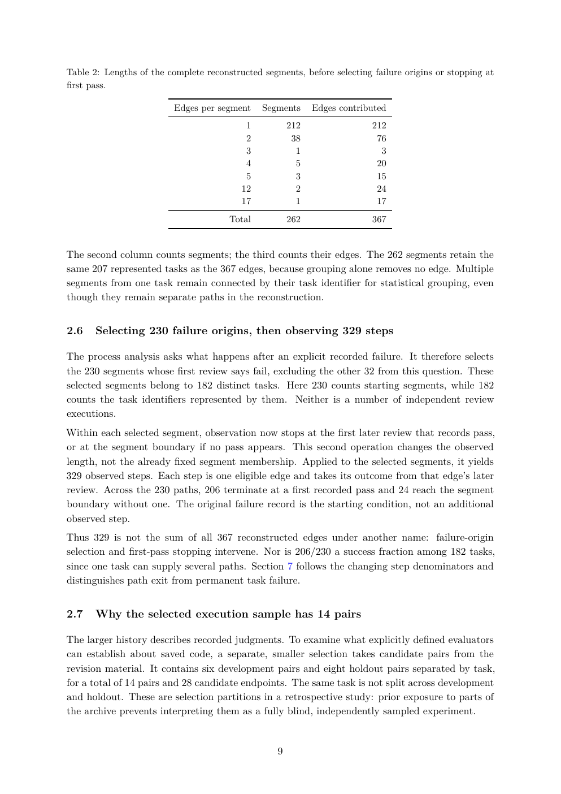

# PDF page 9



## Extracted text

```text
Table 2: Lengths of the complete reconstructed segments, before selecting failure origins or stopping at
first pass.

                          Edges per segment    Segments      Edges contributed
                                           1           212                212
                                           2            38                 76
                                           3             1                  3
                                           4             5                 20
                                           5             3                 15
                                          12             2                 24
                                          17             1                 17
                                       Total           262                367


The second column counts segments; the third counts their edges. The 262 segments retain the
same 207 represented tasks as the 367 edges, because grouping alone removes no edge. Multiple
segments from one task remain connected by their task identifier for statistical grouping, even
though they remain separate paths in the reconstruction.


2.6    Selecting 230 failure origins, then observing 329 steps

The process analysis asks what happens after an explicit recorded failure. It therefore selects
the 230 segments whose first review says fail, excluding the other 32 from this question. These
selected segments belong to 182 distinct tasks. Here 230 counts starting segments, while 182
counts the task identifiers represented by them. Neither is a number of independent review
executions.
Within each selected segment, observation now stops at the first later review that records pass,
or at the segment boundary if no pass appears. This second operation changes the observed
length, not the already fixed segment membership. Applied to the selected segments, it yields
329 observed steps. Each step is one eligible edge and takes its outcome from that edge’s later
review. Across the 230 paths, 206 terminate at a first recorded pass and 24 reach the segment
boundary without one. The original failure record is the starting condition, not an additional
observed step.
Thus 329 is not the sum of all 367 reconstructed edges under another name: failure-origin
selection and first-pass stopping intervene. Nor is 206/230 a success fraction among 182 tasks,
since one task can supply several paths. Section 7 follows the changing step denominators and
distinguishes path exit from permanent task failure.


2.7    Why the selected execution sample has 14 pairs

The larger history describes recorded judgments. To examine what explicitly defined evaluators
can establish about saved code, a separate, smaller selection takes candidate pairs from the
revision material. It contains six development pairs and eight holdout pairs separated by task,
for a total of 14 pairs and 28 candidate endpoints. The same task is not split across development
and holdout. These are selection partitions in a retrospective study: prior exposure to parts of
the archive prevents interpreting them as a fully blind, independently sampled experiment.


                                                   9
```
