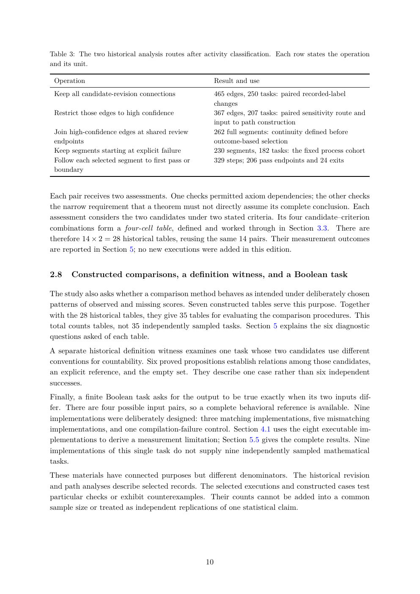

# PDF page 10



## Extracted text

```text
Table 3: The two historical analysis routes after activity classification. Each row states the operation
and its unit.

 Operation                                             Result and use
 Keep all candidate-revision connections               465 edges, 250 tasks: paired recorded-label
                                                       changes
 Restrict those edges to high confidence                367 edges, 207 tasks: paired sensitivity route and
                                                       input to path construction
 Join high-confidence edges at shared review            262 full segments: continuity defined before
 endpoints                                             outcome-based selection
 Keep segments starting at explicit failure            230 segments, 182 tasks: the fixed process cohort
 Follow each selected segment to first pass or          329 steps; 206 pass endpoints and 24 exits
 boundary


Each pair receives two assessments. One checks permitted axiom dependencies; the other checks
the narrow requirement that a theorem must not directly assume its complete conclusion. Each
assessment considers the two candidates under two stated criteria. Its four candidate–criterion
combinations form a four-cell table, defined and worked through in Section 3.3. There are
therefore 14 × 2 = 28 historical tables, reusing the same 14 pairs. Their measurement outcomes
are reported in Section 5; no new executions were added in this edition.


2.8    Constructed comparisons, a definition witness, and a Boolean task

The study also asks whether a comparison method behaves as intended under deliberately chosen
patterns of observed and missing scores. Seven constructed tables serve this purpose. Together
with the 28 historical tables, they give 35 tables for evaluating the comparison procedures. This
total counts tables, not 35 independently sampled tasks. Section 5 explains the six diagnostic
questions asked of each table.
A separate historical definition witness examines one task whose two candidates use different
conventions for countability. Six proved propositions establish relations among those candidates,
an explicit reference, and the empty set. They describe one case rather than six independent
successes.
Finally, a finite Boolean task asks for the output to be true exactly when its two inputs dif-
fer. There are four possible input pairs, so a complete behavioral reference is available. Nine
implementations were deliberately designed: three matching implementations, five mismatching
implementations, and one compilation-failure control. Section 4.1 uses the eight executable im-
plementations to derive a measurement limitation; Section 5.5 gives the complete results. Nine
implementations of this single task do not supply nine independently sampled mathematical
tasks.
These materials have connected purposes but different denominators. The historical revision
and path analyses describe selected records. The selected executions and constructed cases test
particular checks or exhibit counterexamples. Their counts cannot be added into a common
sample size or treated as independent replications of one statistical claim.


                                                  10
```
