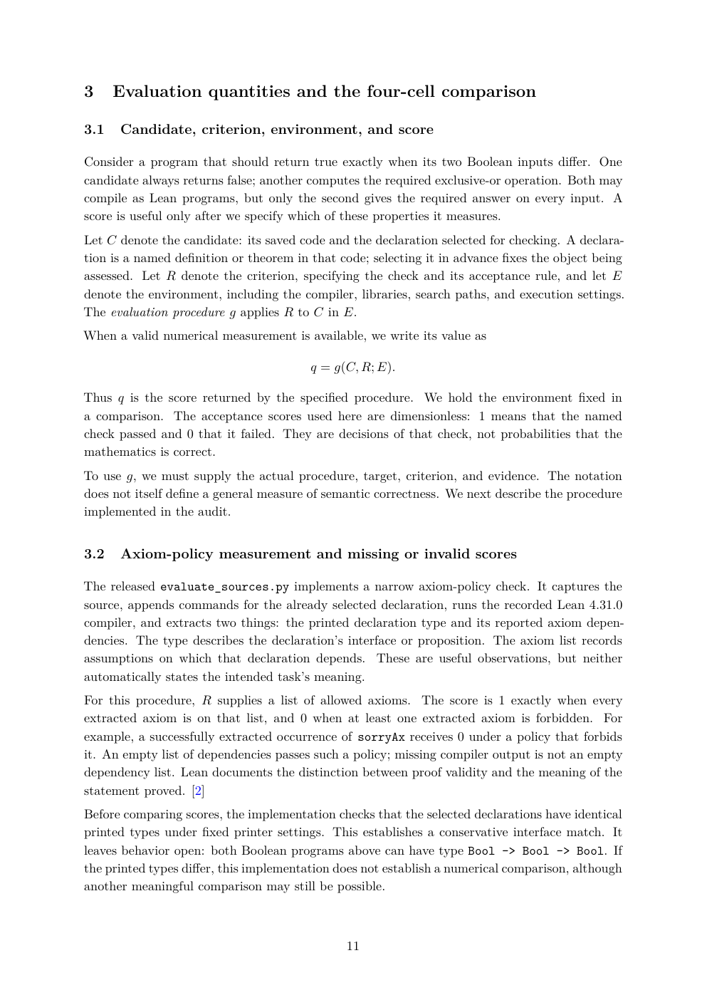

# PDF page 11



## Extracted text

```text
3     Evaluation quantities and the four-cell comparison

3.1   Candidate, criterion, environment, and score

Consider a program that should return true exactly when its two Boolean inputs differ. One
candidate always returns false; another computes the required exclusive-or operation. Both may
compile as Lean programs, but only the second gives the required answer on every input. A
score is useful only after we specify which of these properties it measures.
Let C denote the candidate: its saved code and the declaration selected for checking. A declara-
tion is a named definition or theorem in that code; selecting it in advance fixes the object being
assessed. Let R denote the criterion, specifying the check and its acceptance rule, and let E
denote the environment, including the compiler, libraries, search paths, and execution settings.
The evaluation procedure g applies R to C in E.
When a valid numerical measurement is available, we write its value as

                                        q = g(C, R; E).

Thus q is the score returned by the specified procedure. We hold the environment fixed in
a comparison. The acceptance scores used here are dimensionless: 1 means that the named
check passed and 0 that it failed. They are decisions of that check, not probabilities that the
mathematics is correct.
To use g, we must supply the actual procedure, target, criterion, and evidence. The notation
does not itself define a general measure of semantic correctness. We next describe the procedure
implemented in the audit.


3.2   Axiom-policy measurement and missing or invalid scores

The released evaluate_sources.py implements a narrow axiom-policy check. It captures the
source, appends commands for the already selected declaration, runs the recorded Lean 4.31.0
compiler, and extracts two things: the printed declaration type and its reported axiom depen-
dencies. The type describes the declaration’s interface or proposition. The axiom list records
assumptions on which that declaration depends. These are useful observations, but neither
automatically states the intended task’s meaning.
For this procedure, R supplies a list of allowed axioms. The score is 1 exactly when every
extracted axiom is on that list, and 0 when at least one extracted axiom is forbidden. For
example, a successfully extracted occurrence of sorryAx receives 0 under a policy that forbids
it. An empty list of dependencies passes such a policy; missing compiler output is not an empty
dependency list. Lean documents the distinction between proof validity and the meaning of the
statement proved. [2]
Before comparing scores, the implementation checks that the selected declarations have identical
printed types under fixed printer settings. This establishes a conservative interface match. It
leaves behavior open: both Boolean programs above can have type Bool -> Bool -> Bool. If
the printed types differ, this implementation does not establish a numerical comparison, although
another meaningful comparison may still be possible.


                                              11
```
