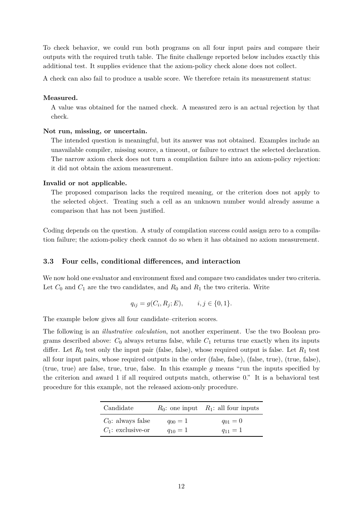

# PDF page 12



## Extracted text

```text
To check behavior, we could run both programs on all four input pairs and compare their
outputs with the required truth table. The finite challenge reported below includes exactly this
additional test. It supplies evidence that the axiom-policy check alone does not collect.
A check can also fail to produce a usable score. We therefore retain its measurement status:

Measured.
 A value was obtained for the named check. A measured zero is an actual rejection by that
 check.

Not run, missing, or uncertain.
 The intended question is meaningful, but its answer was not obtained. Examples include an
  unavailable compiler, missing source, a timeout, or failure to extract the selected declaration.
 The narrow axiom check does not turn a compilation failure into an axiom-policy rejection:
  it did not obtain the axiom measurement.

Invalid or not applicable.
  The proposed comparison lacks the required meaning, or the criterion does not apply to
  the selected object. Treating such a cell as an unknown number would already assume a
  comparison that has not been justified.

Coding depends on the question. A study of compilation success could assign zero to a compila-
tion failure; the axiom-policy check cannot do so when it has obtained no axiom measurement.


3.3    Four cells, conditional differences, and interaction

We now hold one evaluator and environment fixed and compare two candidates under two criteria.
Let C0 and C1 are the two candidates, and R0 and R1 the two criteria. Write

                                qij = g(Ci , Rj ; E),    i, j ∈ {0, 1}.

The example below gives all four candidate–criterion scores.
The following is an illustrative calculation, not another experiment. Use the two Boolean pro-
grams described above: C0 always returns false, while C1 returns true exactly when its inputs
differ. Let R0 test only the input pair (false, false), whose required output is false. Let R1 test
all four input pairs, whose required outputs in the order (false, false), (false, true), (true, false),
(true, true) are false, true, true, false. In this example g means “run the inputs specified by
the criterion and award 1 if all required outputs match, otherwise 0.” It is a behavioral test
procedure for this example, not the released axiom-only procedure.


                      Candidate           R0 : one input    R1 : all four inputs
                      C0 : always false       q00 = 1             q01 = 0
                      C1 : exclusive-or       q10 = 1             q11 = 1


                                                  12
```
