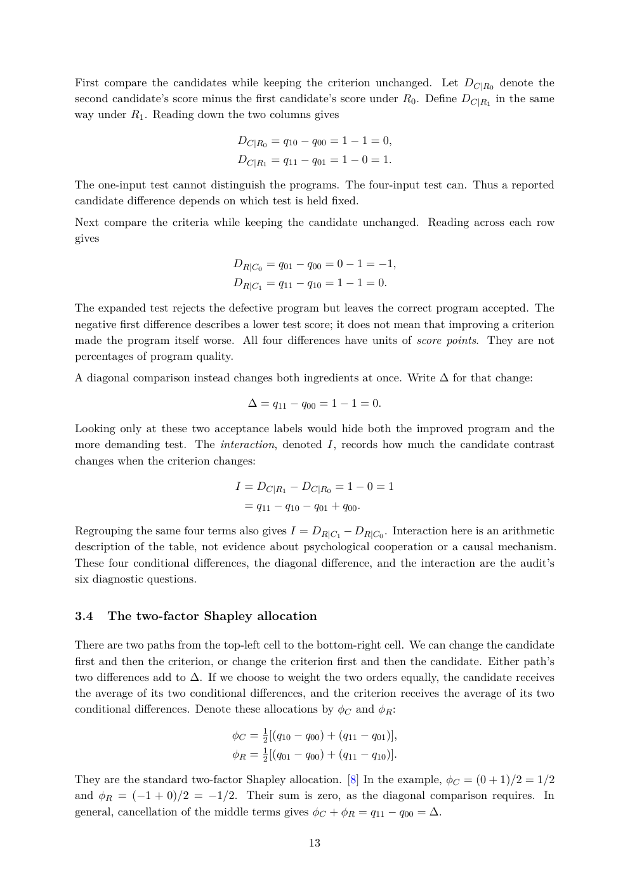

# PDF page 13



## Extracted text

```text
First compare the candidates while keeping the criterion unchanged. Let DC|R0 denote the
second candidate’s score minus the first candidate’s score under R0 . Define DC|R1 in the same
way under R1 . Reading down the two columns gives

                                DC|R0 = q10 − q00 = 1 − 1 = 0,
                                DC|R1 = q11 − q01 = 1 − 0 = 1.

The one-input test cannot distinguish the programs. The four-input test can. Thus a reported
candidate difference depends on which test is held fixed.
Next compare the criteria while keeping the candidate unchanged. Reading across each row
gives

                                DR|C0 = q01 − q00 = 0 − 1 = −1,
                                DR|C1 = q11 − q10 = 1 − 1 = 0.

The expanded test rejects the defective program but leaves the correct program accepted. The
negative first difference describes a lower test score; it does not mean that improving a criterion
made the program itself worse. All four differences have units of score points. They are not
percentages of program quality.
A diagonal comparison instead changes both ingredients at once. Write ∆ for that change:

                                   ∆ = q11 − q00 = 1 − 1 = 0.

Looking only at these two acceptance labels would hide both the improved program and the
more demanding test. The interaction, denoted I, records how much the candidate contrast
changes when the criterion changes:

                                I = DC|R1 − DC|R0 = 1 − 0 = 1
                                  = q11 − q10 − q01 + q00 .

Regrouping the same four terms also gives I = DR|C1 − DR|C0 . Interaction here is an arithmetic
description of the table, not evidence about psychological cooperation or a causal mechanism.
These four conditional differences, the diagonal difference, and the interaction are the audit’s
six diagnostic questions.


3.4   The two-factor Shapley allocation

There are two paths from the top-left cell to the bottom-right cell. We can change the candidate
first and then the criterion, or change the criterion first and then the candidate. Either path’s
two differences add to ∆. If we choose to weight the two orders equally, the candidate receives
the average of its two conditional differences, and the criterion receives the average of its two
conditional differences. Denote these allocations by ϕC and ϕR :

                               ϕC = 12 [(q10 − q00 ) + (q11 − q01 )],
                               ϕR = 21 [(q01 − q00 ) + (q11 − q10 )].

They are the standard two-factor Shapley allocation. [8] In the example, ϕC = (0 + 1)/2 = 1/2
and ϕR = (−1 + 0)/2 = −1/2. Their sum is zero, as the diagonal comparison requires. In
general, cancellation of the middle terms gives ϕC + ϕR = q11 − q00 = ∆.

                                                13
```
