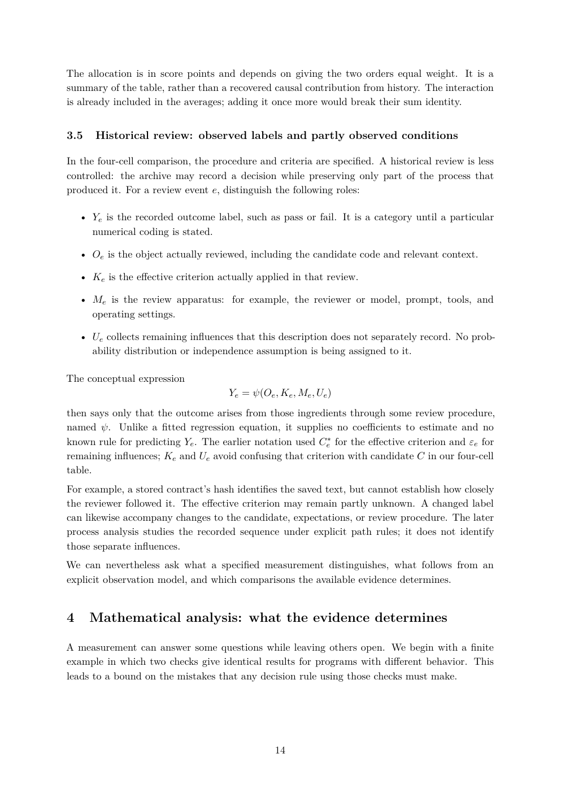

# PDF page 14



## Extracted text

```text
The allocation is in score points and depends on giving the two orders equal weight. It is a
summary of the table, rather than a recovered causal contribution from history. The interaction
is already included in the averages; adding it once more would break their sum identity.


3.5    Historical review: observed labels and partly observed conditions

In the four-cell comparison, the procedure and criteria are specified. A historical review is less
controlled: the archive may record a decision while preserving only part of the process that
produced it. For a review event e, distinguish the following roles:

    • Ye is the recorded outcome label, such as pass or fail. It is a category until a particular
      numerical coding is stated.

    • Oe is the object actually reviewed, including the candidate code and relevant context.

    • Ke is the effective criterion actually applied in that review.

    • Me is the review apparatus: for example, the reviewer or model, prompt, tools, and
      operating settings.

    • Ue collects remaining influences that this description does not separately record. No prob-
      ability distribution or independence assumption is being assigned to it.

The conceptual expression
                                     Ye = ψ(Oe , Ke , Me , Ue )
then says only that the outcome arises from those ingredients through some review procedure,
named ψ. Unlike a fitted regression equation, it supplies no coefficients to estimate and no
known rule for predicting Ye . The earlier notation used Ce∗ for the effective criterion and εe for
remaining influences; Ke and Ue avoid confusing that criterion with candidate C in our four-cell
table.
For example, a stored contract’s hash identifies the saved text, but cannot establish how closely
the reviewer followed it. The effective criterion may remain partly unknown. A changed label
can likewise accompany changes to the candidate, expectations, or review procedure. The later
process analysis studies the recorded sequence under explicit path rules; it does not identify
those separate influences.
We can nevertheless ask what a specified measurement distinguishes, what follows from an
explicit observation model, and which comparisons the available evidence determines.


4     Mathematical analysis: what the evidence determines

A measurement can answer some questions while leaving others open. We begin with a finite
example in which two checks give identical results for programs with different behavior. This
leads to a bound on the mistakes that any decision rule using those checks must make.


                                                14
```
