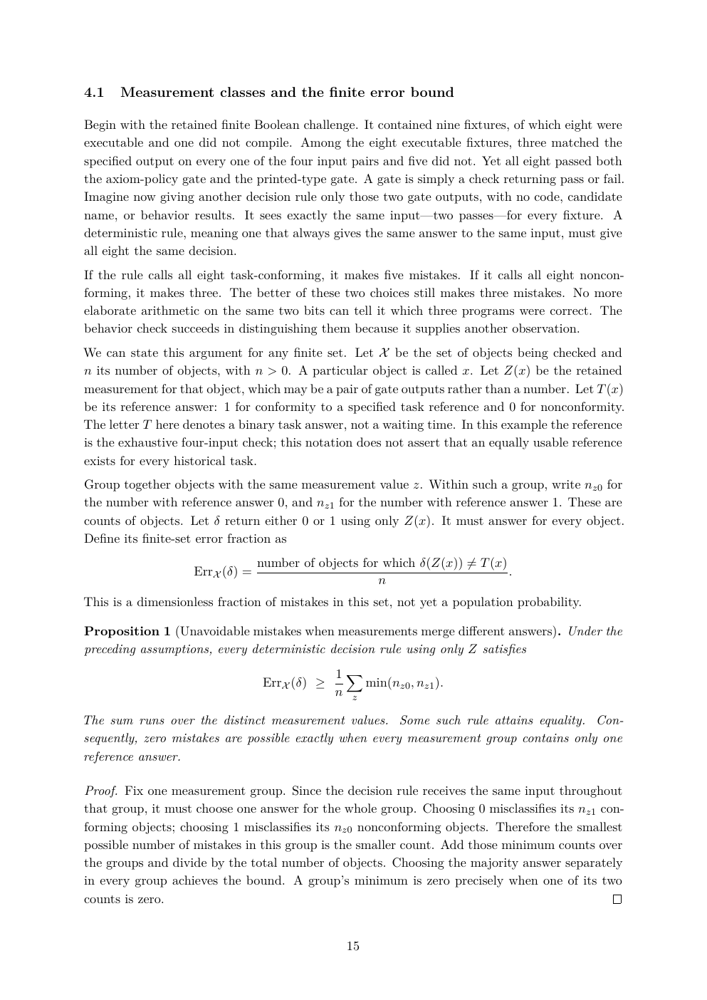

# PDF page 15



## Extracted text

```text
4.1   Measurement classes and the finite error bound

Begin with the retained finite Boolean challenge. It contained nine fixtures, of which eight were
executable and one did not compile. Among the eight executable fixtures, three matched the
specified output on every one of the four input pairs and five did not. Yet all eight passed both
the axiom-policy gate and the printed-type gate. A gate is simply a check returning pass or fail.
Imagine now giving another decision rule only those two gate outputs, with no code, candidate
name, or behavior results. It sees exactly the same input—two passes—for every fixture. A
deterministic rule, meaning one that always gives the same answer to the same input, must give
all eight the same decision.
If the rule calls all eight task-conforming, it makes five mistakes. If it calls all eight noncon-
forming, it makes three. The better of these two choices still makes three mistakes. No more
elaborate arithmetic on the same two bits can tell it which three programs were correct. The
behavior check succeeds in distinguishing them because it supplies another observation.
We can state this argument for any finite set. Let X be the set of objects being checked and
n its number of objects, with n > 0. A particular object is called x. Let Z(x) be the retained
measurement for that object, which may be a pair of gate outputs rather than a number. Let T (x)
be its reference answer: 1 for conformity to a specified task reference and 0 for nonconformity.
The letter T here denotes a binary task answer, not a waiting time. In this example the reference
is the exhaustive four-input check; this notation does not assert that an equally usable reference
exists for every historical task.
Group together objects with the same measurement value z. Within such a group, write nz0 for
the number with reference answer 0, and nz1 for the number with reference answer 1. These are
counts of objects. Let δ return either 0 or 1 using only Z(x). It must answer for every object.
Define its finite-set error fraction as
                                 number of objects for which δ(Z(x)) ̸= T (x)
                    ErrX (δ) =                                                .
                                                      n
This is a dimensionless fraction of mistakes in this set, not yet a population probability.

Proposition 1 (Unavoidable mistakes when measurements merge different answers). Under the
preceding assumptions, every deterministic decision rule using only Z satisfies
                                               1X
                                  ErrX (δ) ≥       min(nz0 , nz1 ).
                                               n z

The sum runs over the distinct measurement values. Some such rule attains equality. Con-
sequently, zero mistakes are possible exactly when every measurement group contains only one
reference answer.

Proof. Fix one measurement group. Since the decision rule receives the same input throughout
that group, it must choose one answer for the whole group. Choosing 0 misclassifies its nz1 con-
forming objects; choosing 1 misclassifies its nz0 nonconforming objects. Therefore the smallest
possible number of mistakes in this group is the smaller count. Add those minimum counts over
the groups and divide by the total number of objects. Choosing the majority answer separately
in every group achieves the bound. A group’s minimum is zero precisely when one of its two
counts is zero.


                                                 15
```
