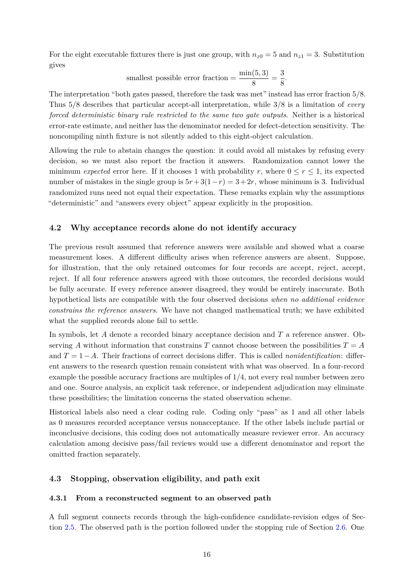

# PDF page 16



## Extracted text

```text
For the eight executable fixtures there is just one group, with nz0 = 5 and nz1 = 3. Substitution
gives
                                                           min(5, 3)   3
                        smallest possible error fraction =           = .
                                                               8       8
The interpretation “both gates passed, therefore the task was met” instead has error fraction 5/8.
Thus 5/8 describes that particular accept-all interpretation, while 3/8 is a limitation of every
forced deterministic binary rule restricted to the same two gate outputs. Neither is a historical
error-rate estimate, and neither has the denominator needed for defect-detection sensitivity. The
noncompiling ninth fixture is not silently added to this eight-object calculation.
Allowing the rule to abstain changes the question: it could avoid all mistakes by refusing every
decision, so we must also report the fraction it answers. Randomization cannot lower the
minimum expected error here. If it chooses 1 with probability r, where 0 ≤ r ≤ 1, its expected
number of mistakes in the single group is 5r + 3(1 − r) = 3 + 2r, whose minimum is 3. Individual
randomized runs need not equal their expectation. These remarks explain why the assumptions
“deterministic” and “answers every object” appear explicitly in the proposition.


4.2     Why acceptance records alone do not identify accuracy

The previous result assumed that reference answers were available and showed what a coarse
measurement loses. A different difficulty arises when reference answers are absent. Suppose,
for illustration, that the only retained outcomes for four records are accept, reject, accept,
reject. If all four reference answers agreed with those outcomes, the recorded decisions would
be fully accurate. If every reference answer disagreed, they would be entirely inaccurate. Both
hypothetical lists are compatible with the four observed decisions when no additional evidence
constrains the reference answers. We have not changed mathematical truth; we have exhibited
what the supplied records alone fail to settle.
In symbols, let A denote a recorded binary acceptance decision and T a reference answer. Ob-
serving A without information that constrains T cannot choose between the possibilities T = A
and T = 1 − A. Their fractions of correct decisions differ. This is called nonidentification: differ-
ent answers to the research question remain consistent with what was observed. In a four-record
example the possible accuracy fractions are multiples of 1/4, not every real number between zero
and one. Source analysis, an explicit task reference, or independent adjudication may eliminate
these possibilities; the limitation concerns the stated observation scheme.
Historical labels also need a clear coding rule. Coding only “pass” as 1 and all other labels
as 0 measures recorded acceptance versus nonacceptance. If the other labels include partial or
inconclusive decisions, this coding does not automatically measure reviewer error. An accuracy
calculation among decisive pass/fail reviews would use a different denominator and report the
omitted fraction separately.


4.3     Stopping, observation eligibility, and path exit

4.3.1    From a reconstructed segment to an observed path

A full segment connects records through the high-confidence candidate-revision edges of Sec-
tion 2.5. The observed path is the portion followed under the stopping rule of Section 2.6. One


                                               16
```
