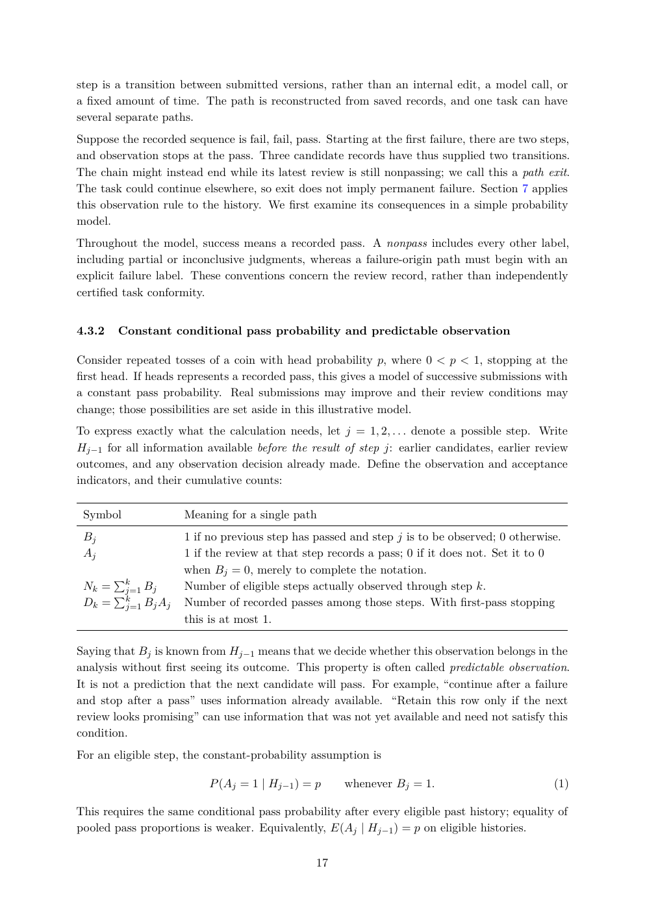

# PDF page 17



## Extracted text

```text
step is a transition between submitted versions, rather than an internal edit, a model call, or
a fixed amount of time. The path is reconstructed from saved records, and one task can have
several separate paths.
Suppose the recorded sequence is fail, fail, pass. Starting at the first failure, there are two steps,
and observation stops at the pass. Three candidate records have thus supplied two transitions.
The chain might instead end while its latest review is still nonpassing; we call this a path exit.
The task could continue elsewhere, so exit does not imply permanent failure. Section 7 applies
this observation rule to the history. We first examine its consequences in a simple probability
model.
Throughout the model, success means a recorded pass. A nonpass includes every other label,
including partial or inconclusive judgments, whereas a failure-origin path must begin with an
explicit failure label. These conventions concern the review record, rather than independently
certified task conformity.


4.3.2   Constant conditional pass probability and predictable observation

Consider repeated tosses of a coin with head probability p, where 0 < p < 1, stopping at the
first head. If heads represents a recorded pass, this gives a model of successive submissions with
a constant pass probability. Real submissions may improve and their review conditions may
change; those possibilities are set aside in this illustrative model.
To express exactly what the calculation needs, let j = 1, 2, . . . denote a possible step. Write
Hj−1 for all information available before the result of step j: earlier candidates, earlier review
outcomes, and any observation decision already made. Define the observation and acceptance
indicators, and their cumulative counts:

 Symbol               Meaning for a single path
 Bj                   1 if no previous step has passed and step j is to be observed; 0 otherwise.
 Aj                   1 if the review at that step records a pass; 0 if it does not. Set it to 0
                      when Bj = 0, merely to complete the notation.
        P
 Nk = kj=1 Bj         Number of eligible steps actually observed through step k.
     P
 Dk = kj=1 Bj Aj      Number of recorded passes among those steps. With first-pass stopping
                      this is at most 1.

Saying that Bj is known from Hj−1 means that we decide whether this observation belongs in the
analysis without first seeing its outcome. This property is often called predictable observation.
It is not a prediction that the next candidate will pass. For example, “continue after a failure
and stop after a pass” uses information already available. “Retain this row only if the next
review looks promising” can use information that was not yet available and need not satisfy this
condition.
For an eligible step, the constant-probability assumption is

                           P (Aj = 1 | Hj−1 ) = p     whenever Bj = 1.                           (1)

This requires the same conditional pass probability after every eligible past history; equality of
pooled pass proportions is weaker. Equivalently, E(Aj | Hj−1 ) = p on eligible histories.

                                                 17
```
