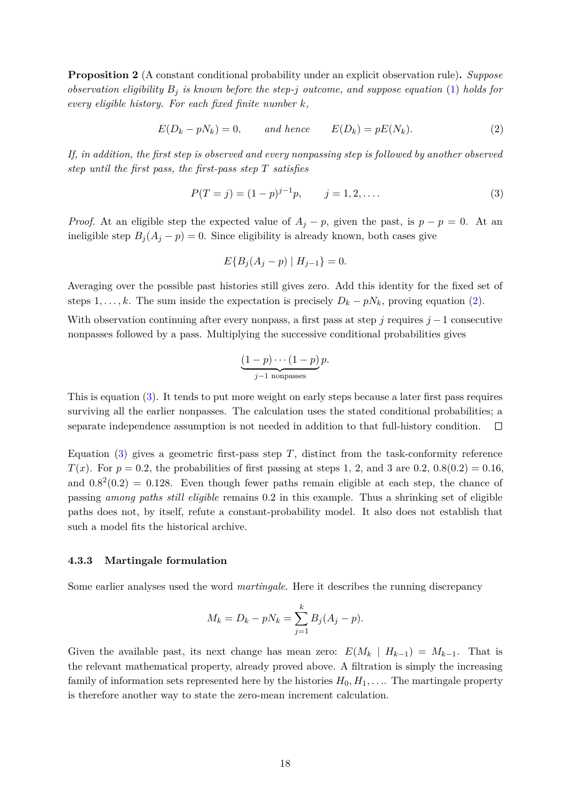

# PDF page 18



## Extracted text

```text
Proposition 2 (A constant conditional probability under an explicit observation rule). Suppose
observation eligibility Bj is known before the step-j outcome, and suppose equation (1) holds for
every eligible history. For each fixed finite number k,

                    E(Dk − pNk ) = 0,         and hence            E(Dk ) = pE(Nk ).              (2)

If, in addition, the first step is observed and every nonpassing step is followed by another observed
step until the first pass, the first-pass step T satisfies

                            P (T = j) = (1 − p)j−1 p,             j = 1, 2, . . . .               (3)

Proof. At an eligible step the expected value of Aj − p, given the past, is p − p = 0. At an
ineligible step Bj (Aj − p) = 0. Since eligibility is already known, both cases give

                                    E{Bj (Aj − p) | Hj−1 } = 0.

Averaging over the possible past histories still gives zero. Add this identity for the fixed set of
steps 1, . . . , k. The sum inside the expectation is precisely Dk − pNk , proving equation (2).
With observation continuing after every nonpass, a first pass at step j requires j − 1 consecutive
nonpasses followed by a pass. Multiplying the successive conditional probabilities gives

                                        (1 − p) · · · (1 − p) p.
                                        |        {z           }
                                            j−1 nonpasses

This is equation (3). It tends to put more weight on early steps because a later first pass requires
surviving all the earlier nonpasses. The calculation uses the stated conditional probabilities; a
separate independence assumption is not needed in addition to that full-history condition.

Equation (3) gives a geometric first-pass step T , distinct from the task-conformity reference
T (x). For p = 0.2, the probabilities of first passing at steps 1, 2, and 3 are 0.2, 0.8(0.2) = 0.16,
and 0.82 (0.2) = 0.128. Even though fewer paths remain eligible at each step, the chance of
passing among paths still eligible remains 0.2 in this example. Thus a shrinking set of eligible
paths does not, by itself, refute a constant-probability model. It also does not establish that
such a model fits the historical archive.


4.3.3   Martingale formulation

Some earlier analyses used the word martingale. Here it describes the running discrepancy

                                                       X
                                                       k
                                Mk = Dk − pNk =              Bj (Aj − p).
                                                       j=1

Given the available past, its next change has mean zero: E(Mk | Hk−1 ) = Mk−1 . That is
the relevant mathematical property, already proved above. A filtration is simply the increasing
family of information sets represented here by the histories H0 , H1 , . . .. The martingale property
is therefore another way to state the zero-mean increment calculation.


                                                  18
```
