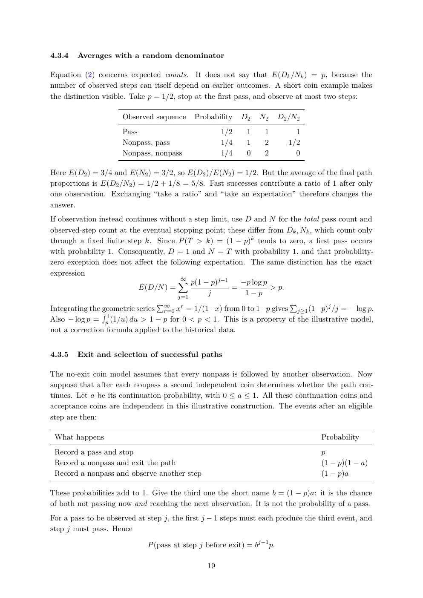

# PDF page 19



## Extracted text

```text
4.3.4   Averages with a random denominator

Equation (2) concerns expected counts. It does not say that E(Dk /Nk ) = p, because the
number of observed steps can itself depend on earlier outcomes. A short coin example makes
the distinction visible. Take p = 1/2, stop at the first pass, and observe at most two steps:

                     Observed sequence     Probability    D2    N2      D2 /N2
                     Pass                           1/2     1    1          1
                     Nonpass, pass                  1/4     1    2        1/2
                     Nonpass, nonpass               1/4     0    2          0

Here E(D2 ) = 3/4 and E(N2 ) = 3/2, so E(D2 )/E(N2 ) = 1/2. But the average of the final path
proportions is E(D2 /N2 ) = 1/2 + 1/8 = 5/8. Fast successes contribute a ratio of 1 after only
one observation. Exchanging “take a ratio” and “take an expectation” therefore changes the
answer.
If observation instead continues without a step limit, use D and N for the total pass count and
observed-step count at the eventual stopping point; these differ from Dk , Nk , which count only
through a fixed finite step k. Since P (T > k) = (1 − p)k tends to zero, a first pass occurs
with probability 1. Consequently, D = 1 and N = T with probability 1, and that probability-
zero exception does not affect the following expectation. The same distinction has the exact
expression
                                      X∞
                                          p(1 − p)j−1    −p log p
                          E(D/N ) =                    =          > p.
                                      j=1
                                               j           1−p
                               P                                           P
Integrating the geometric series ∞     r
                                  r=0 x = 1/(1−x) from 0 to 1−p gives  j≥1 (1−p) /j = − log p.
                                                                                 j
                R1
Also − log p = p (1/u) du > 1 − p for 0 < p < 1. This is a property of the illustrative model,
not a correction formula applied to the historical data.


4.3.5   Exit and selection of successful paths

The no-exit coin model assumes that every nonpass is followed by another observation. Now
suppose that after each nonpass a second independent coin determines whether the path con-
tinues. Let a be its continuation probability, with 0 ≤ a ≤ 1. All these continuation coins and
acceptance coins are independent in this illustrative construction. The events after an eligible
step are then:

 What happens                                                                    Probability
 Record a pass and stop                                                          p
 Record a nonpass and exit the path                                              (1 − p)(1 − a)
 Record a nonpass and observe another step                                       (1 − p)a

These probabilities add to 1. Give the third one the short name b = (1 − p)a: it is the chance
of both not passing now and reaching the next observation. It is not the probability of a pass.
For a pass to be observed at step j, the first j − 1 steps must each produce the third event, and
step j must pass. Hence

                             P (pass at step j before exit) = bj−1 p.

                                               19
```
