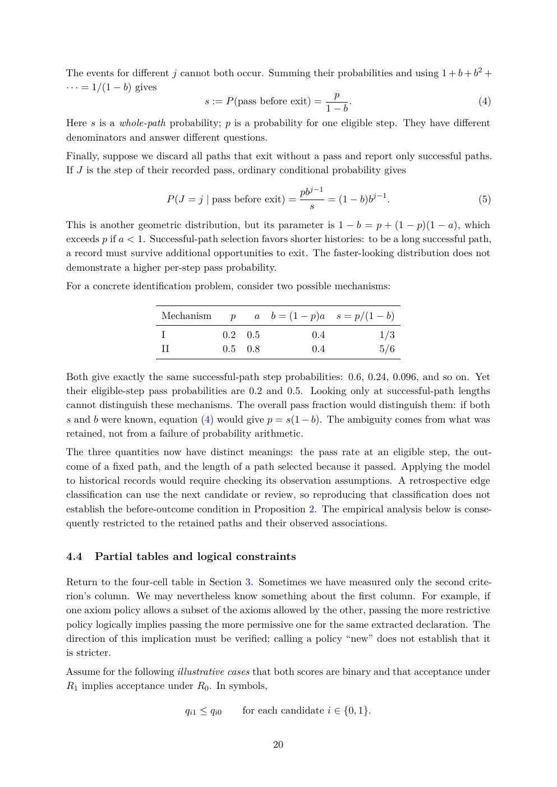

# PDF page 20



## Extracted text

```text
The events for different j cannot both occur. Summing their probabilities and using 1 + b + b2 +
· · · = 1/(1 − b) gives
                                                             p
                               s := P (pass before exit) =       .                           (4)
                                                            1−b
Here s is a whole-path probability; p is a probability for one eligible step. They have different
denominators and answer different questions.
Finally, suppose we discard all paths that exit without a pass and report only successful paths.
If J is the step of their recorded pass, ordinary conditional probability gives

                                                           pbj−1
                       P (J = j | pass before exit) =            = (1 − b)bj−1 .                 (5)
                                                             s
This is another geometric distribution, but its parameter is 1 − b = p + (1 − p)(1 − a), which
exceeds p if a < 1. Successful-path selection favors shorter histories: to be a long successful path,
a record must survive additional opportunities to exit. The faster-looking distribution does not
demonstrate a higher per-step pass probability.
For a concrete identification problem, consider two possible mechanisms:

                      Mechanism          p      a    b = (1 − p)a   s = p/(1 − b)
                      I                 0.2    0.5            0.4              1/3
                      II                0.5    0.8            0.4              5/6

Both give exactly the same successful-path step probabilities: 0.6, 0.24, 0.096, and so on. Yet
their eligible-step pass probabilities are 0.2 and 0.5. Looking only at successful-path lengths
cannot distinguish these mechanisms. The overall pass fraction would distinguish them: if both
s and b were known, equation (4) would give p = s(1 − b). The ambiguity comes from what was
retained, not from a failure of probability arithmetic.
The three quantities now have distinct meanings: the pass rate at an eligible step, the out-
come of a fixed path, and the length of a path selected because it passed. Applying the model
to historical records would require checking its observation assumptions. A retrospective edge
classification can use the next candidate or review, so reproducing that classification does not
establish the before-outcome condition in Proposition 2. The empirical analysis below is conse-
quently restricted to the retained paths and their observed associations.


4.4   Partial tables and logical constraints

Return to the four-cell table in Section 3. Sometimes we have measured only the second crite-
rion’s column. We may nevertheless know something about the first column. For example, if
one axiom policy allows a subset of the axioms allowed by the other, passing the more restrictive
policy logically implies passing the more permissive one for the same extracted declaration. The
direction of this implication must be verified; calling a policy “new” does not establish that it
is stricter.
Assume for the following illustrative cases that both scores are binary and that acceptance under
R1 implies acceptance under R0 . In symbols,

                            qi1 ≤ qi0         for each candidate i ∈ {0, 1}.


                                                     20
```
