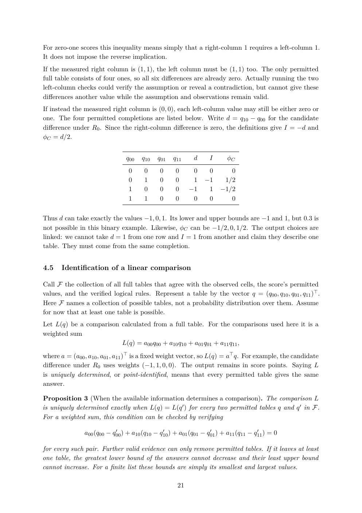

# PDF page 21



## Extracted text

```text
For zero-one scores this inequality means simply that a right-column 1 requires a left-column 1.
It does not impose the reverse implication.
If the measured right column is (1, 1), the left column must be (1, 1) too. The only permitted
full table consists of four ones, so all six differences are already zero. Actually running the two
left-column checks could verify the assumption or reveal a contradiction, but cannot give these
differences another value while the assumption and observations remain valid.
If instead the measured right column is (0, 0), each left-column value may still be either zero or
one. The four permitted completions are listed below. Write d = q10 − q00 for the candidate
difference under R0 . Since the right-column difference is zero, the definitions give I = −d and
ϕC = d/2.


                               q00   q10   q01   q11     d     I      ϕC
                                0     0     0     0      0    0       0
                                0     1     0     0      1   −1     1/2
                                1     0     0     0     −1    1    −1/2
                                1     1     0     0      0    0       0


Thus d can take exactly the values −1, 0, 1. Its lower and upper bounds are −1 and 1, but 0.3 is
not possible in this binary example. Likewise, ϕC can be −1/2, 0, 1/2. The output choices are
linked: we cannot take d = 1 from one row and I = 1 from another and claim they describe one
table. They must come from the same completion.


4.5    Identification of a linear comparison

Call F the collection of all full tables that agree with the observed cells, the score’s permitted
values, and the verified logical rules. Represent a table by the vector q = (q00 , q10 , q01 , q11 )⊤ .
Here F names a collection of possible tables, not a probability distribution over them. Assume
for now that at least one table is possible.
Let L(q) be a comparison calculated from a full table. For the comparisons used here it is a
weighted sum
                         L(q) = a00 q00 + a10 q10 + a01 q01 + a11 q11 ,
where a = (a00 , a10 , a01 , a11 )⊤ is a fixed weight vector, so L(q) = a⊤ q. For example, the candidate
difference under R0 uses weights (−1, 1, 0, 0). The output remains in score points. Saying L
is uniquely determined, or point-identified, means that every permitted table gives the same
answer.

Proposition 3 (When the available information determines a comparison). The comparison L
is uniquely determined exactly when L(q) = L(q ′ ) for every two permitted tables q and q ′ in F.
For a weighted sum, this condition can be checked by verifying
                           ′                  ′                  ′                  ′
               a00 (q00 − q00 ) + a10 (q10 − q10 ) + a01 (q01 − q01 ) + a11 (q11 − q11 )=0

for every such pair. Further valid evidence can only remove permitted tables. If it leaves at least
one table, the greatest lower bound of the answers cannot decrease and their least upper bound
cannot increase. For a finite list these bounds are simply its smallest and largest values.

                                                   21
```
