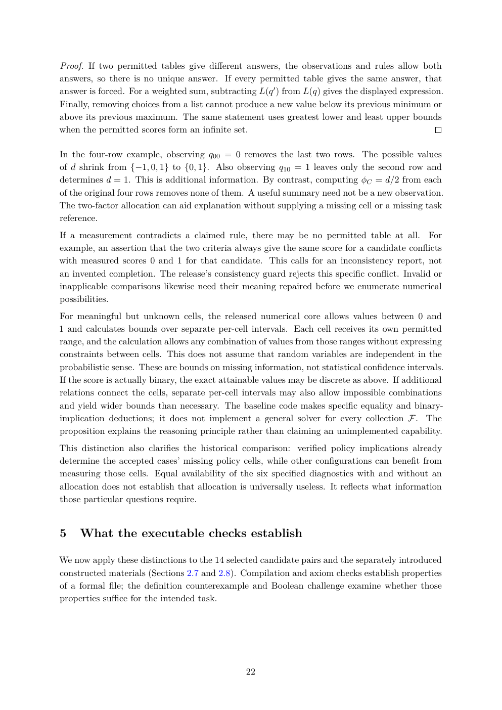

# PDF page 22



## Extracted text

```text
Proof. If two permitted tables give different answers, the observations and rules allow both
answers, so there is no unique answer. If every permitted table gives the same answer, that
answer is forced. For a weighted sum, subtracting L(q ′ ) from L(q) gives the displayed expression.
Finally, removing choices from a list cannot produce a new value below its previous minimum or
above its previous maximum. The same statement uses greatest lower and least upper bounds
when the permitted scores form an infinite set.

In the four-row example, observing q00 = 0 removes the last two rows. The possible values
of d shrink from {−1, 0, 1} to {0, 1}. Also observing q10 = 1 leaves only the second row and
determines d = 1. This is additional information. By contrast, computing ϕC = d/2 from each
of the original four rows removes none of them. A useful summary need not be a new observation.
The two-factor allocation can aid explanation without supplying a missing cell or a missing task
reference.
If a measurement contradicts a claimed rule, there may be no permitted table at all. For
example, an assertion that the two criteria always give the same score for a candidate conflicts
with measured scores 0 and 1 for that candidate. This calls for an inconsistency report, not
an invented completion. The release’s consistency guard rejects this specific conflict. Invalid or
inapplicable comparisons likewise need their meaning repaired before we enumerate numerical
possibilities.
For meaningful but unknown cells, the released numerical core allows values between 0 and
1 and calculates bounds over separate per-cell intervals. Each cell receives its own permitted
range, and the calculation allows any combination of values from those ranges without expressing
constraints between cells. This does not assume that random variables are independent in the
probabilistic sense. These are bounds on missing information, not statistical confidence intervals.
If the score is actually binary, the exact attainable values may be discrete as above. If additional
relations connect the cells, separate per-cell intervals may also allow impossible combinations
and yield wider bounds than necessary. The baseline code makes specific equality and binary-
implication deductions; it does not implement a general solver for every collection F. The
proposition explains the reasoning principle rather than claiming an unimplemented capability.
This distinction also clarifies the historical comparison: verified policy implications already
determine the accepted cases’ missing policy cells, while other configurations can benefit from
measuring those cells. Equal availability of the six specified diagnostics with and without an
allocation does not establish that allocation is universally useless. It reflects what information
those particular questions require.


5    What the executable checks establish

We now apply these distinctions to the 14 selected candidate pairs and the separately introduced
constructed materials (Sections 2.7 and 2.8). Compilation and axiom checks establish properties
of a formal file; the definition counterexample and Boolean challenge examine whether those
properties suffice for the intended task.


                                                22
```
