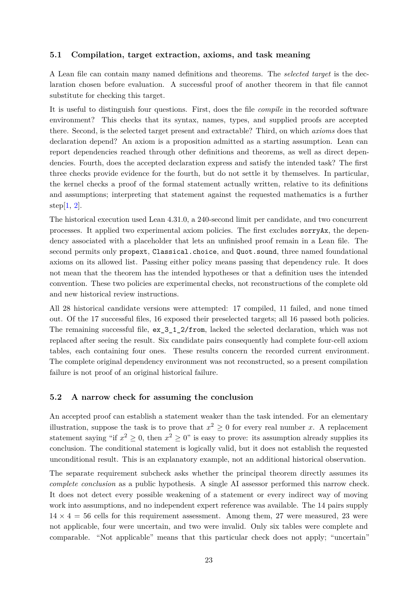

# PDF page 23



## Extracted text

```text
5.1   Compilation, target extraction, axioms, and task meaning

A Lean file can contain many named definitions and theorems. The selected target is the dec-
laration chosen before evaluation. A successful proof of another theorem in that file cannot
substitute for checking this target.
It is useful to distinguish four questions. First, does the file compile in the recorded software
environment? This checks that its syntax, names, types, and supplied proofs are accepted
there. Second, is the selected target present and extractable? Third, on which axioms does that
declaration depend? An axiom is a proposition admitted as a starting assumption. Lean can
report dependencies reached through other definitions and theorems, as well as direct depen-
dencies. Fourth, does the accepted declaration express and satisfy the intended task? The first
three checks provide evidence for the fourth, but do not settle it by themselves. In particular,
the kernel checks a proof of the formal statement actually written, relative to its definitions
and assumptions; interpreting that statement against the requested mathematics is a further
step[1, 2].
The historical execution used Lean 4.31.0, a 240-second limit per candidate, and two concurrent
processes. It applied two experimental axiom policies. The first excludes sorryAx, the depen-
dency associated with a placeholder that lets an unfinished proof remain in a Lean file. The
second permits only propext, Classical.choice, and Quot.sound, three named foundational
axioms on its allowed list. Passing either policy means passing that dependency rule. It does
not mean that the theorem has the intended hypotheses or that a definition uses the intended
convention. These two policies are experimental checks, not reconstructions of the complete old
and new historical review instructions.
All 28 historical candidate versions were attempted: 17 compiled, 11 failed, and none timed
out. Of the 17 successful files, 16 exposed their preselected targets; all 16 passed both policies.
The remaining successful file, ex_3_1_2/from, lacked the selected declaration, which was not
replaced after seeing the result. Six candidate pairs consequently had complete four-cell axiom
tables, each containing four ones. These results concern the recorded current environment.
The complete original dependency environment was not reconstructed, so a present compilation
failure is not proof of an original historical failure.


5.2   A narrow check for assuming the conclusion

An accepted proof can establish a statement weaker than the task intended. For an elementary
illustration, suppose the task is to prove that x2 ≥ 0 for every real number x. A replacement
statement saying “if x2 ≥ 0, then x2 ≥ 0” is easy to prove: its assumption already supplies its
conclusion. The conditional statement is logically valid, but it does not establish the requested
unconditional result. This is an explanatory example, not an additional historical observation.
The separate requirement subcheck asks whether the principal theorem directly assumes its
complete conclusion as a public hypothesis. A single AI assessor performed this narrow check.
It does not detect every possible weakening of a statement or every indirect way of moving
work into assumptions, and no independent expert reference was available. The 14 pairs supply
14 × 4 = 56 cells for this requirement assessment. Among them, 27 were measured, 23 were
not applicable, four were uncertain, and two were invalid. Only six tables were complete and
comparable. “Not applicable” means that this particular check does not apply; “uncertain”


                                               23
```
