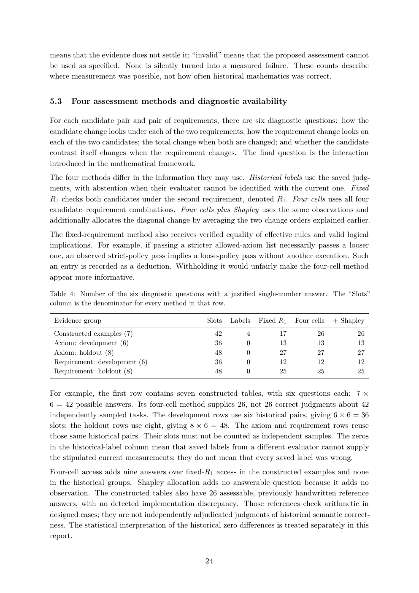

# PDF page 24



## Extracted text

```text
means that the evidence does not settle it; “invalid” means that the proposed assessment cannot
be used as specified. None is silently turned into a measured failure. These counts describe
where measurement was possible, not how often historical mathematics was correct.


5.3   Four assessment methods and diagnostic availability

For each candidate pair and pair of requirements, there are six diagnostic questions: how the
candidate change looks under each of the two requirements; how the requirement change looks on
each of the two candidates; the total change when both are changed; and whether the candidate
contrast itself changes when the requirement changes. The final question is the interaction
introduced in the mathematical framework.
The four methods differ in the information they may use. Historical labels use the saved judg-
ments, with abstention when their evaluator cannot be identified with the current one. Fixed
R1 checks both candidates under the second requirement, denoted R1 . Four cells uses all four
candidate–requirement combinations. Four cells plus Shapley uses the same observations and
additionally allocates the diagonal change by averaging the two change orders explained earlier.
The fixed-requirement method also receives verified equality of effective rules and valid logical
implications. For example, if passing a stricter allowed-axiom list necessarily passes a looser
one, an observed strict-policy pass implies a loose-policy pass without another execution. Such
an entry is recorded as a deduction. Withholding it would unfairly make the four-cell method
appear more informative.

Table 4: Number of the six diagnostic questions with a justified single-number answer. The “Slots”
column is the denominator for every method in that row.

 Evidence group                                  Slots    Labels   Fixed R1   Four cells   + Shapley
 Constructed examples (7)                            42       4          17          26           26
 Axiom: development (6)                              36       0          13          13           13
 Axiom: holdout (8)                                  48       0          27          27           27
 Requirement: development (6)                        36       0          12          12           12
 Requirement: holdout (8)                            48       0          25          25           25


For example, the first row contains seven constructed tables, with six questions each: 7 ×
6 = 42 possible answers. Its four-cell method supplies 26, not 26 correct judgments about 42
independently sampled tasks. The development rows use six historical pairs, giving 6 × 6 = 36
slots; the holdout rows use eight, giving 8 × 6 = 48. The axiom and requirement rows reuse
those same historical pairs. Their slots must not be counted as independent samples. The zeros
in the historical-label column mean that saved labels from a different evaluator cannot supply
the stipulated current measurements; they do not mean that every saved label was wrong.
Four-cell access adds nine answers over fixed-R1 access in the constructed examples and none
in the historical groups. Shapley allocation adds no answerable question because it adds no
observation. The constructed tables also have 26 assessable, previously handwritten reference
answers, with no detected implementation discrepancy. Those references check arithmetic in
designed cases; they are not independently adjudicated judgments of historical semantic correct-
ness. The statistical interpretation of the historical zero differences is treated separately in this
report.


                                                24
```
