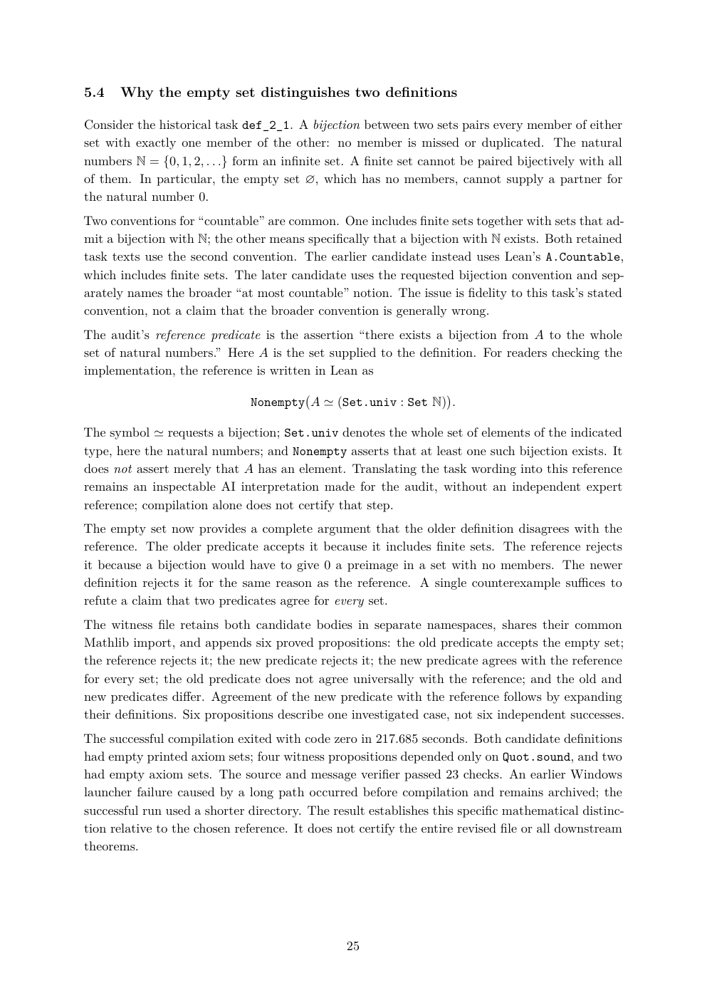

# PDF page 25



## Extracted text

```text
5.4   Why the empty set distinguishes two definitions

Consider the historical task def_2_1. A bijection between two sets pairs every member of either
set with exactly one member of the other: no member is missed or duplicated. The natural
numbers N = {0, 1, 2, . . .} form an infinite set. A finite set cannot be paired bijectively with all
of them. In particular, the empty set ∅, which has no members, cannot supply a partner for
the natural number 0.
Two conventions for “countable” are common. One includes finite sets together with sets that ad-
mit a bijection with N; the other means specifically that a bijection with N exists. Both retained
task texts use the second convention. The earlier candidate instead uses Lean’s A.Countable,
which includes finite sets. The later candidate uses the requested bijection convention and sep-
arately names the broader “at most countable” notion. The issue is fidelity to this task’s stated
convention, not a claim that the broader convention is generally wrong.
The audit’s reference predicate is the assertion “there exists a bijection from A to the whole
set of natural numbers.” Here A is the set supplied to the definition. For readers checking the
implementation, the reference is written in Lean as
                                                                  
                              Nonempty A ≃ (Set.univ : Set N) .

The symbol ≃ requests a bijection; Set.univ denotes the whole set of elements of the indicated
type, here the natural numbers; and Nonempty asserts that at least one such bijection exists. It
does not assert merely that A has an element. Translating the task wording into this reference
remains an inspectable AI interpretation made for the audit, without an independent expert
reference; compilation alone does not certify that step.
The empty set now provides a complete argument that the older definition disagrees with the
reference. The older predicate accepts it because it includes finite sets. The reference rejects
it because a bijection would have to give 0 a preimage in a set with no members. The newer
definition rejects it for the same reason as the reference. A single counterexample suffices to
refute a claim that two predicates agree for every set.
The witness file retains both candidate bodies in separate namespaces, shares their common
Mathlib import, and appends six proved propositions: the old predicate accepts the empty set;
the reference rejects it; the new predicate rejects it; the new predicate agrees with the reference
for every set; the old predicate does not agree universally with the reference; and the old and
new predicates differ. Agreement of the new predicate with the reference follows by expanding
their definitions. Six propositions describe one investigated case, not six independent successes.
The successful compilation exited with code zero in 217.685 seconds. Both candidate definitions
had empty printed axiom sets; four witness propositions depended only on Quot.sound, and two
had empty axiom sets. The source and message verifier passed 23 checks. An earlier Windows
launcher failure caused by a long path occurred before compilation and remains archived; the
successful run used a shorter directory. The result establishes this specific mathematical distinc-
tion relative to the chosen reference. It does not certify the entire revised file or all downstream
theorems.


                                                25
```
