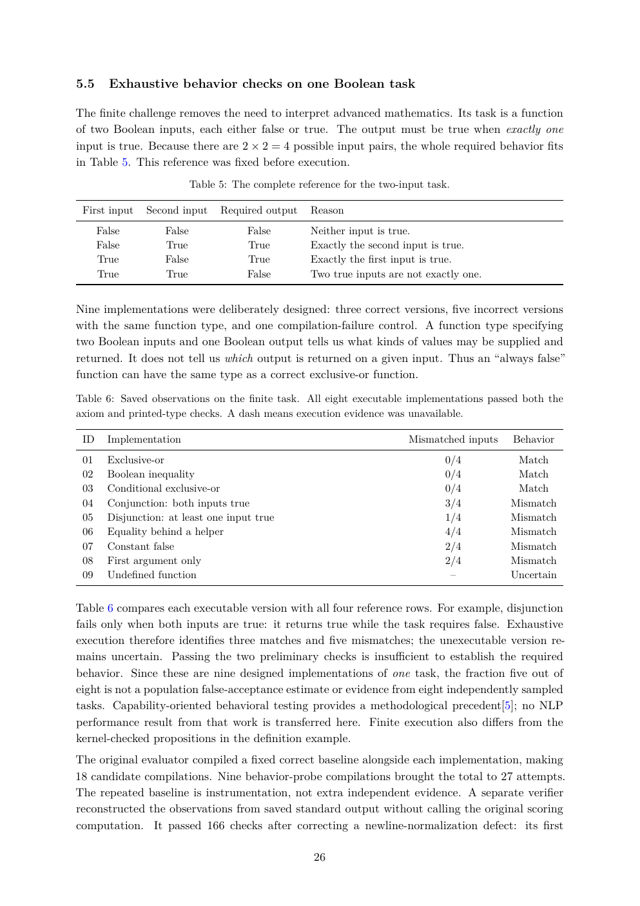

# PDF page 26



## Extracted text

```text
5.5     Exhaustive behavior checks on one Boolean task

The finite challenge removes the need to interpret advanced mathematics. Its task is a function
of two Boolean inputs, each either false or true. The output must be true when exactly one
input is true. Because there are 2 × 2 = 4 possible input pairs, the whole required behavior fits
in Table 5. This reference was fixed before execution.
                            Table 5: The complete reference for the two-input task.

 First input    Second input      Required output    Reason
      False         False               False        Neither input is true.
      False         True                True         Exactly the second input is true.
      True          False               True         Exactly the first input is true.
      True          True                False        Two true inputs are not exactly one.


Nine implementations were deliberately designed: three correct versions, five incorrect versions
with the same function type, and one compilation-failure control. A function type specifying
two Boolean inputs and one Boolean output tells us what kinds of values may be supplied and
returned. It does not tell us which output is returned on a given input. Thus an “always false”
function can have the same type as a correct exclusive-or function.

Table 6: Saved observations on the finite task. All eight executable implementations passed both the
axiom and printed-type checks. A dash means execution evidence was unavailable.

 ID     Implementation                                                    Mismatched inputs   Behavior
 01     Exclusive-or                                                              0/4          Match
 02     Boolean inequality                                                        0/4          Match
 03     Conditional exclusive-or                                                  0/4          Match
 04     Conjunction: both inputs true                                             3/4         Mismatch
 05     Disjunction: at least one input true                                      1/4         Mismatch
 06     Equality behind a helper                                                  4/4         Mismatch
 07     Constant false                                                            2/4         Mismatch
 08     First argument only                                                       2/4         Mismatch
 09     Undefined function                                                          –          Uncertain


Table 6 compares each executable version with all four reference rows. For example, disjunction
fails only when both inputs are true: it returns true while the task requires false. Exhaustive
execution therefore identifies three matches and five mismatches; the unexecutable version re-
mains uncertain. Passing the two preliminary checks is insufficient to establish the required
behavior. Since these are nine designed implementations of one task, the fraction five out of
eight is not a population false-acceptance estimate or evidence from eight independently sampled
tasks. Capability-oriented behavioral testing provides a methodological precedent[5]; no NLP
performance result from that work is transferred here. Finite execution also differs from the
kernel-checked propositions in the definition example.
The original evaluator compiled a fixed correct baseline alongside each implementation, making
18 candidate compilations. Nine behavior-probe compilations brought the total to 27 attempts.
The repeated baseline is instrumentation, not extra independent evidence. A separate verifier
reconstructed the observations from saved standard output without calling the original scoring
computation. It passed 166 checks after correcting a newline-normalization defect: its first

                                                      26
```
