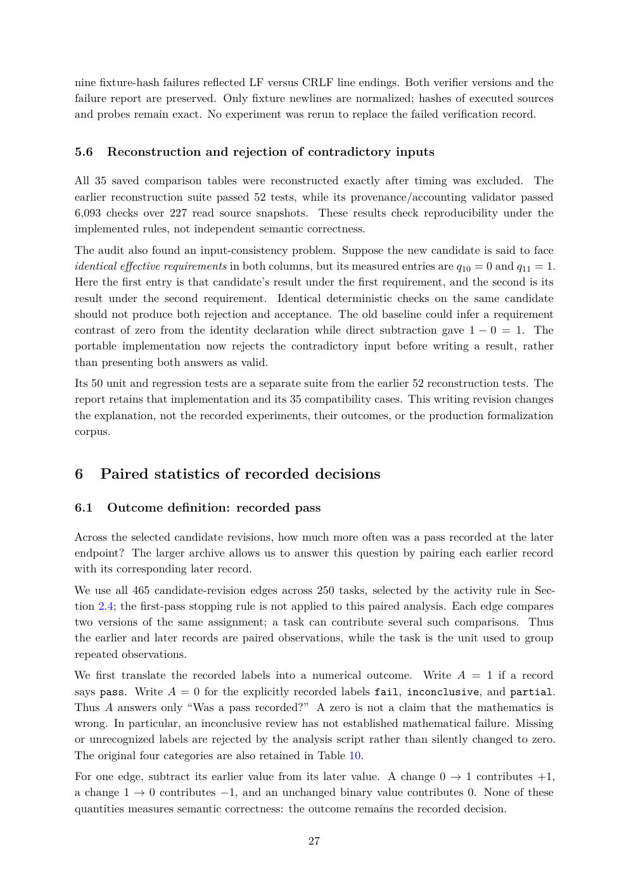

# PDF page 27



## Extracted text

```text
nine fixture-hash failures reflected LF versus CRLF line endings. Both verifier versions and the
failure report are preserved. Only fixture newlines are normalized; hashes of executed sources
and probes remain exact. No experiment was rerun to replace the failed verification record.


5.6   Reconstruction and rejection of contradictory inputs

All 35 saved comparison tables were reconstructed exactly after timing was excluded. The
earlier reconstruction suite passed 52 tests, while its provenance/accounting validator passed
6,093 checks over 227 read source snapshots. These results check reproducibility under the
implemented rules, not independent semantic correctness.
The audit also found an input-consistency problem. Suppose the new candidate is said to face
identical effective requirements in both columns, but its measured entries are q10 = 0 and q11 = 1.
Here the first entry is that candidate’s result under the first requirement, and the second is its
result under the second requirement. Identical deterministic checks on the same candidate
should not produce both rejection and acceptance. The old baseline could infer a requirement
contrast of zero from the identity declaration while direct subtraction gave 1 − 0 = 1. The
portable implementation now rejects the contradictory input before writing a result, rather
than presenting both answers as valid.
Its 50 unit and regression tests are a separate suite from the earlier 52 reconstruction tests. The
report retains that implementation and its 35 compatibility cases. This writing revision changes
the explanation, not the recorded experiments, their outcomes, or the production formalization
corpus.


6     Paired statistics of recorded decisions

6.1   Outcome definition: recorded pass

Across the selected candidate revisions, how much more often was a pass recorded at the later
endpoint? The larger archive allows us to answer this question by pairing each earlier record
with its corresponding later record.
We use all 465 candidate-revision edges across 250 tasks, selected by the activity rule in Sec-
tion 2.4; the first-pass stopping rule is not applied to this paired analysis. Each edge compares
two versions of the same assignment; a task can contribute several such comparisons. Thus
the earlier and later records are paired observations, while the task is the unit used to group
repeated observations.
We first translate the recorded labels into a numerical outcome. Write A = 1 if a record
says pass. Write A = 0 for the explicitly recorded labels fail, inconclusive, and partial.
Thus A answers only “Was a pass recorded?” A zero is not a claim that the mathematics is
wrong. In particular, an inconclusive review has not established mathematical failure. Missing
or unrecognized labels are rejected by the analysis script rather than silently changed to zero.
The original four categories are also retained in Table 10.
For one edge, subtract its earlier value from its later value. A change 0 → 1 contributes +1,
a change 1 → 0 contributes −1, and an unchanged binary value contributes 0. None of these
quantities measures semantic correctness: the outcome remains the recorded decision.

                                                27
```
