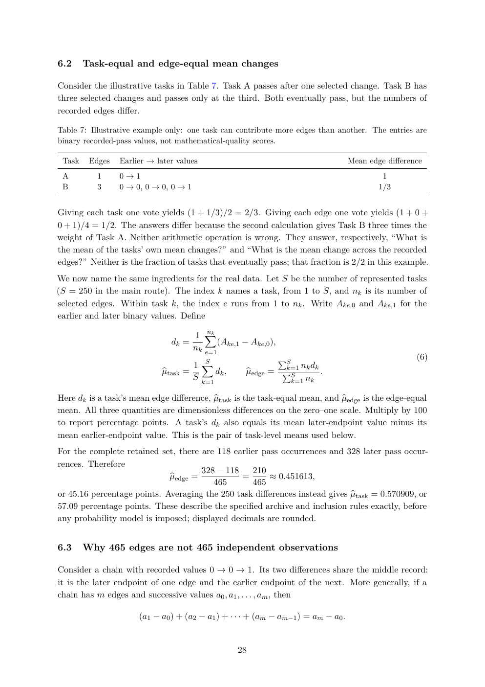

# PDF page 28



## Extracted text

```text
6.2     Task-equal and edge-equal mean changes

Consider the illustrative tasks in Table 7. Task A passes after one selected change. Task B has
three selected changes and passes only at the third. Both eventually pass, but the numbers of
recorded edges differ.

Table 7: Illustrative example only: one task can contribute more edges than another. The entries are
binary recorded-pass values, not mathematical-quality scores.

 Task    Edges   Earlier → later values                                            Mean edge difference
 A         1     0→1                                                                       1
 B         3     0 → 0, 0 → 0, 0 → 1                                                      1/3


Giving each task one vote yields (1 + 1/3)/2 = 2/3. Giving each edge one vote yields (1 + 0 +
0 + 1)/4 = 1/2. The answers differ because the second calculation gives Task B three times the
weight of Task A. Neither arithmetic operation is wrong. They answer, respectively, “What is
the mean of the tasks’ own mean changes?” and “What is the mean change across the recorded
edges?” Neither is the fraction of tasks that eventually pass; that fraction is 2/2 in this example.
We now name the same ingredients for the real data. Let S be the number of represented tasks
(S = 250 in the main route). The index k names a task, from 1 to S, and nk is its number of
selected edges. Within task k, the index e runs from 1 to nk . Write Ake,0 and Ake,1 for the
earlier and later binary values. Define

                                       1 X
                                           nk
                               dk =           (Ake,1 − Ake,0 ),
                                       nk e=1
                                                                  PS                                (6)
                                    1 XS
                                                                  k=1 nk dk
                            btask =
                            µ             dk ,        bedge =
                                                      µ           PS        .
                                    S k=1                          k=1 nk

                                         btask is the task-equal mean, and µ
Here dk is a task’s mean edge difference, µ                                 bedge is the edge-equal
mean. All three quantities are dimensionless differences on the zero–one scale. Multiply by 100
to report percentage points. A task’s dk also equals its mean later-endpoint value minus its
mean earlier-endpoint value. This is the pair of task-level means used below.
For the complete retained set, there are 118 earlier pass occurrences and 328 later pass occur-
rences. Therefore
                                     328 − 118     210
                             bedge =
                             µ                 =       ≈ 0.451613,
                                        465        465
                                                                            btask = 0.570909, or
or 45.16 percentage points. Averaging the 250 task differences instead gives µ
57.09 percentage points. These describe the specified archive and inclusion rules exactly, before
any probability model is imposed; displayed decimals are rounded.


6.3     Why 465 edges are not 465 independent observations

Consider a chain with recorded values 0 → 0 → 1. Its two differences share the middle record:
it is the later endpoint of one edge and the earlier endpoint of the next. More generally, if a
chain has m edges and successive values a0 , a1 , . . . , am , then

                      (a1 − a0 ) + (a2 − a1 ) + · · · + (am − am−1 ) = am − a0 .


                                                   28
```
