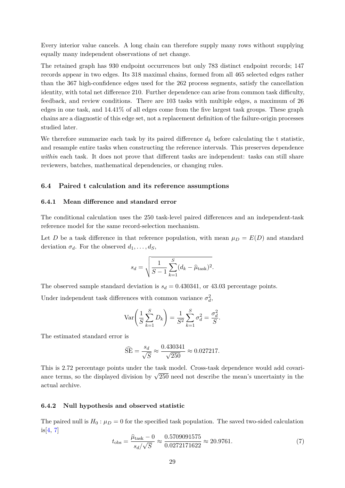

# PDF page 29



## Extracted text

```text
Every interior value cancels. A long chain can therefore supply many rows without supplying
equally many independent observations of net change.
The retained graph has 930 endpoint occurrences but only 783 distinct endpoint records; 147
records appear in two edges. Its 318 maximal chains, formed from all 465 selected edges rather
than the 367 high-confidence edges used for the 262 process segments, satisfy the cancellation
identity, with total net difference 210. Further dependence can arise from common task difficulty,
feedback, and review conditions. There are 103 tasks with multiple edges, a maximum of 26
edges in one task, and 14.41% of all edges come from the five largest task groups. These graph
chains are a diagnostic of this edge set, not a replacement definition of the failure-origin processes
studied later.
We therefore summarize each task by its paired difference dk before calculating the t statistic,
and resample entire tasks when constructing the reference intervals. This preserves dependence
within each task. It does not prove that different tasks are independent: tasks can still share
reviewers, batches, mathematical dependencies, or changing rules.


6.4     Paired t calculation and its reference assumptions

6.4.1    Mean difference and standard error

The conditional calculation uses the 250 task-level paired differences and an independent-task
reference model for the same record-selection mechanism.
Let D be a task difference in that reference population, with mean µD = E(D) and standard
deviation σd . For the observed d1 , . . . , dS ,
                                       v
                                       u
                                       u     1 X  S
                                  sd = t            (dk − µ
                                                          btask )2 .
                                           S − 1 k=1

The observed sample standard deviation is sd = 0.430341, or 43.03 percentage points.
Under independent task differences with common variance σd2 ,
                                               !
                                   1 XS
                                                        1 X  S
                                                                  2   σd2
                               Var       Dk        =            σ d =     .
                                   S k=1                S 2 k=1       S

The estimated standard error is
                                    sd
                                c = √    0.430341
                                SE      ≈ √       ≈ 0.027217.
                                      S      250
This is 2.72 percentage points under the task model. Cross-task dependence would add covari-
                                        √
ance terms, so the displayed division by 250 need not describe the mean’s uncertainty in the
actual archive.


6.4.2    Null hypothesis and observed statistic

The paired null is H0 : µD = 0 for the specified task population. The saved two-sided calculation
is[4, 7]
                                 µbtask − 0   0.5709091575
                          tobs =       √ ≈                  ≈ 20.9761.                        (7)
                                   sd / S     0.0272171622

                                                   29
```
