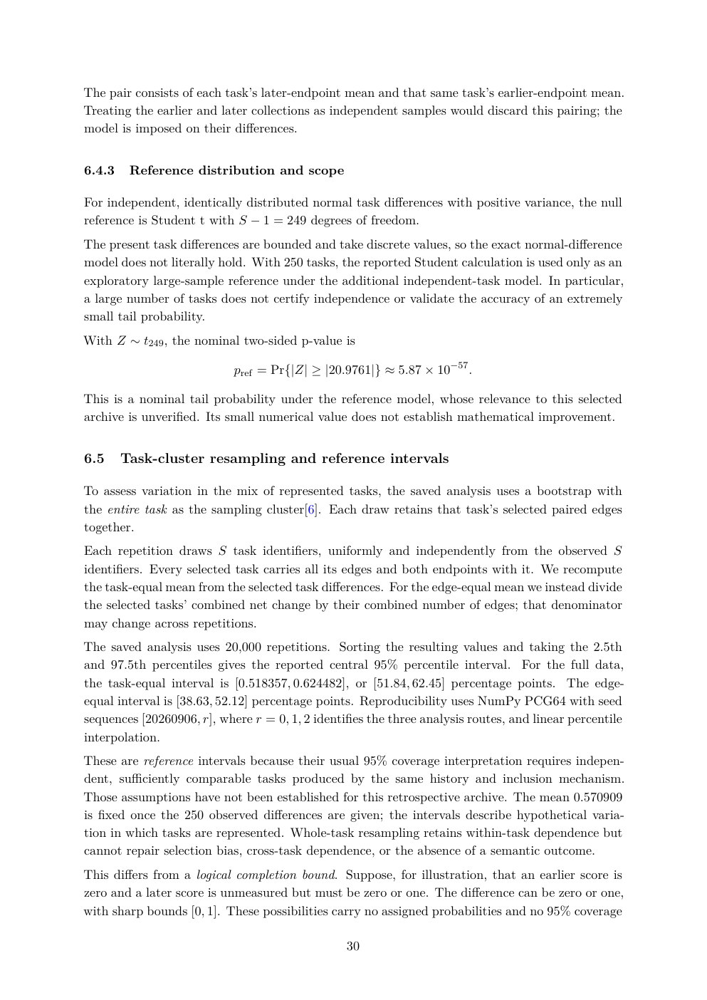

# PDF page 30



## Extracted text

```text
The pair consists of each task’s later-endpoint mean and that same task’s earlier-endpoint mean.
Treating the earlier and later collections as independent samples would discard this pairing; the
model is imposed on their differences.


6.4.3    Reference distribution and scope

For independent, identically distributed normal task differences with positive variance, the null
reference is Student t with S − 1 = 249 degrees of freedom.
The present task differences are bounded and take discrete values, so the exact normal-difference
model does not literally hold. With 250 tasks, the reported Student calculation is used only as an
exploratory large-sample reference under the additional independent-task model. In particular,
a large number of tasks does not certify independence or validate the accuracy of an extremely
small tail probability.
With Z ∼ t249 , the nominal two-sided p-value is

                            pref = Pr{|Z| ≥ |20.9761|} ≈ 5.87 × 10−57 .

This is a nominal tail probability under the reference model, whose relevance to this selected
archive is unverified. Its small numerical value does not establish mathematical improvement.


6.5     Task-cluster resampling and reference intervals

To assess variation in the mix of represented tasks, the saved analysis uses a bootstrap with
the entire task as the sampling cluster[6]. Each draw retains that task’s selected paired edges
together.
Each repetition draws S task identifiers, uniformly and independently from the observed S
identifiers. Every selected task carries all its edges and both endpoints with it. We recompute
the task-equal mean from the selected task differences. For the edge-equal mean we instead divide
the selected tasks’ combined net change by their combined number of edges; that denominator
may change across repetitions.
The saved analysis uses 20,000 repetitions. Sorting the resulting values and taking the 2.5th
and 97.5th percentiles gives the reported central 95% percentile interval. For the full data,
the task-equal interval is [0.518357, 0.624482], or [51.84, 62.45] percentage points. The edge-
equal interval is [38.63, 52.12] percentage points. Reproducibility uses NumPy PCG64 with seed
sequences [20260906, r], where r = 0, 1, 2 identifies the three analysis routes, and linear percentile
interpolation.
These are reference intervals because their usual 95% coverage interpretation requires indepen-
dent, sufficiently comparable tasks produced by the same history and inclusion mechanism.
Those assumptions have not been established for this retrospective archive. The mean 0.570909
is fixed once the 250 observed differences are given; the intervals describe hypothetical varia-
tion in which tasks are represented. Whole-task resampling retains within-task dependence but
cannot repair selection bias, cross-task dependence, or the absence of a semantic outcome.
This differs from a logical completion bound. Suppose, for illustration, that an earlier score is
zero and a later score is unmeasured but must be zero or one. The difference can be zero or one,
with sharp bounds [0, 1]. These possibilities carry no assigned probabilities and no 95% coverage

                                                 30
```
