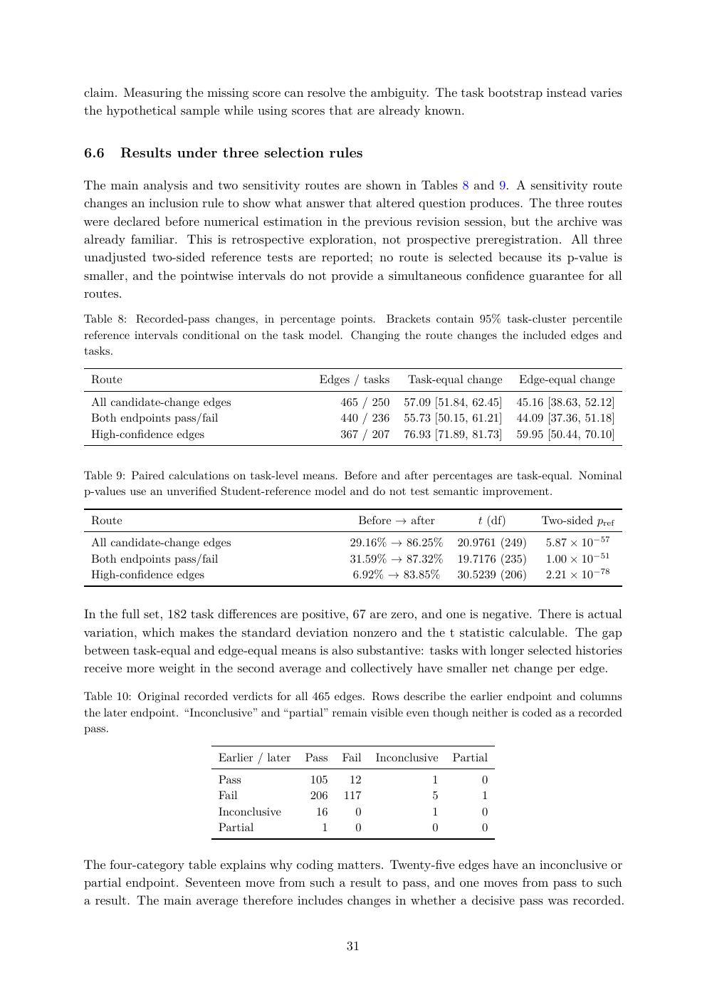

# PDF page 31



## Extracted text

```text
claim. Measuring the missing score can resolve the ambiguity. The task bootstrap instead varies
the hypothetical sample while using scores that are already known.


6.6    Results under three selection rules

The main analysis and two sensitivity routes are shown in Tables 8 and 9. A sensitivity route
changes an inclusion rule to show what answer that altered question produces. The three routes
were declared before numerical estimation in the previous revision session, but the archive was
already familiar. This is retrospective exploration, not prospective preregistration. All three
unadjusted two-sided reference tests are reported; no route is selected because its p-value is
smaller, and the pointwise intervals do not provide a simultaneous confidence guarantee for all
routes.
Table 8: Recorded-pass changes, in percentage points. Brackets contain 95% task-cluster percentile
reference intervals conditional on the task model. Changing the route changes the included edges and
tasks.

 Route                                        Edges / tasks     Task-equal change      Edge-equal change
 All candidate-change edges                        465 / 250   57.09 [51.84, 62.45]    45.16 [38.63, 52.12]
 Both endpoints pass/fail                          440 / 236   55.73 [50.15, 61.21]    44.09 [37.36, 51.18]
 High-confidence edges                              367 / 207   76.93 [71.89, 81.73]    59.95 [50.44, 70.10]


Table 9: Paired calculations on task-level means. Before and after percentages are task-equal. Nominal
p-values use an unverified Student-reference model and do not test semantic improvement.

 Route                                                Before → after          t (df)        Two-sided pref
 All candidate-change edges                         29.16% → 86.25%      20.9761 (249)      5.87 × 10−57
 Both endpoints pass/fail                           31.59% → 87.32%      19.7176 (235)      1.00 × 10−51
 High-confidence edges                                6.92% → 83.85%      30.5239 (206)      2.21 × 10−78


In the full set, 182 task differences are positive, 67 are zero, and one is negative. There is actual
variation, which makes the standard deviation nonzero and the t statistic calculable. The gap
between task-equal and edge-equal means is also substantive: tasks with longer selected histories
receive more weight in the second average and collectively have smaller net change per edge.

Table 10: Original recorded verdicts for all 465 edges. Rows describe the earlier endpoint and columns
the later endpoint. “Inconclusive” and “partial” remain visible even though neither is coded as a recorded
pass.

                          Earlier / later   Pass   Fail   Inconclusive   Partial
                          Pass              105     12              1         0
                          Fail              206    117              5         1
                          Inconclusive       16      0              1         0
                          Partial             1      0              0         0


The four-category table explains why coding matters. Twenty-five edges have an inconclusive or
partial endpoint. Seventeen move from such a result to pass, and one moves from pass to such
a result. The main average therefore includes changes in whether a decisive pass was recorded.


                                                    31
```
