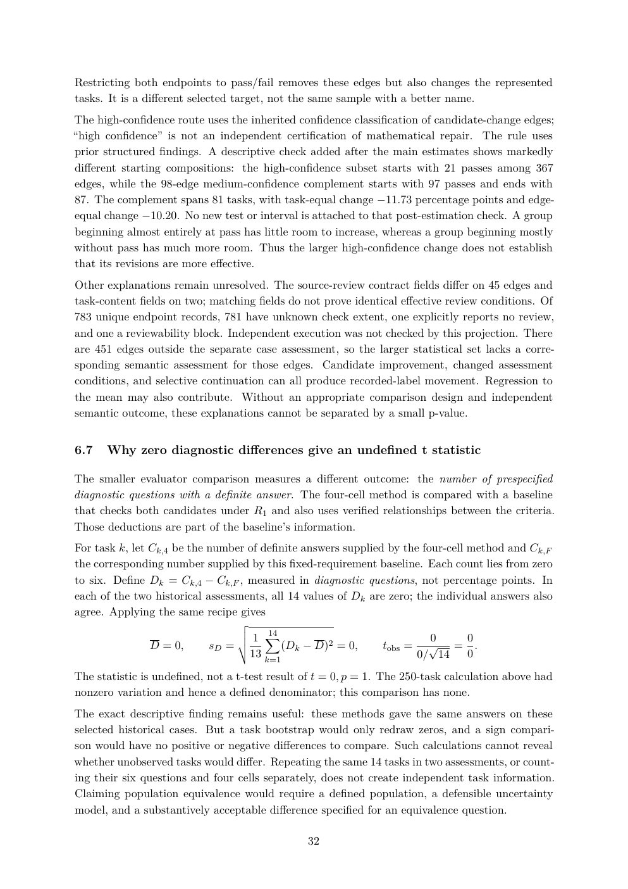

# PDF page 32



## Extracted text

```text
Restricting both endpoints to pass/fail removes these edges but also changes the represented
tasks. It is a different selected target, not the same sample with a better name.
The high-confidence route uses the inherited confidence classification of candidate-change edges;
“high confidence” is not an independent certification of mathematical repair. The rule uses
prior structured findings. A descriptive check added after the main estimates shows markedly
different starting compositions: the high-confidence subset starts with 21 passes among 367
edges, while the 98-edge medium-confidence complement starts with 97 passes and ends with
87. The complement spans 81 tasks, with task-equal change −11.73 percentage points and edge-
equal change −10.20. No new test or interval is attached to that post-estimation check. A group
beginning almost entirely at pass has little room to increase, whereas a group beginning mostly
without pass has much more room. Thus the larger high-confidence change does not establish
that its revisions are more effective.
Other explanations remain unresolved. The source-review contract fields differ on 45 edges and
task-content fields on two; matching fields do not prove identical effective review conditions. Of
783 unique endpoint records, 781 have unknown check extent, one explicitly reports no review,
and one a reviewability block. Independent execution was not checked by this projection. There
are 451 edges outside the separate case assessment, so the larger statistical set lacks a corre-
sponding semantic assessment for those edges. Candidate improvement, changed assessment
conditions, and selective continuation can all produce recorded-label movement. Regression to
the mean may also contribute. Without an appropriate comparison design and independent
semantic outcome, these explanations cannot be separated by a small p-value.


6.7   Why zero diagnostic differences give an undefined t statistic

The smaller evaluator comparison measures a different outcome: the number of prespecified
diagnostic questions with a definite answer. The four-cell method is compared with a baseline
that checks both candidates under R1 and also uses verified relationships between the criteria.
Those deductions are part of the baseline’s information.
For task k, let Ck,4 be the number of definite answers supplied by the four-cell method and Ck,F
the corresponding number supplied by this fixed-requirement baseline. Each count lies from zero
to six. Define Dk = Ck,4 − Ck,F , measured in diagnostic questions, not percentage points. In
each of the two historical assessments, all 14 values of Dk are zero; the individual answers also
agree. Applying the same recipe gives
                                v
                                u
                                u1 X
                                   14
                                                                          0   0
               D = 0,      sD = t     (Dk − D)2 = 0,           tobs =     √ = .
                                   13 k=1                               0/ 14 0

The statistic is undefined, not a t-test result of t = 0, p = 1. The 250-task calculation above had
nonzero variation and hence a defined denominator; this comparison has none.
The exact descriptive finding remains useful: these methods gave the same answers on these
selected historical cases. But a task bootstrap would only redraw zeros, and a sign compari-
son would have no positive or negative differences to compare. Such calculations cannot reveal
whether unobserved tasks would differ. Repeating the same 14 tasks in two assessments, or count-
ing their six questions and four cells separately, does not create independent task information.
Claiming population equivalence would require a defined population, a defensible uncertainty
model, and a substantively acceptable difference specified for an equivalence question.

                                               32
```
