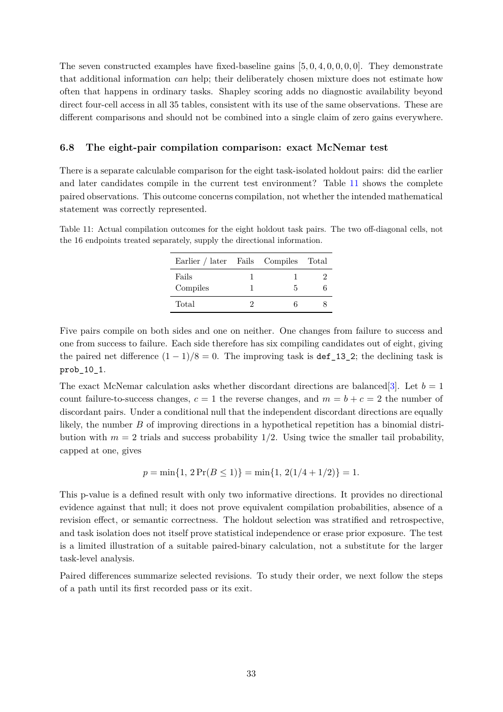

# PDF page 33



## Extracted text

```text
The seven constructed examples have fixed-baseline gains [5, 0, 4, 0, 0, 0, 0]. They demonstrate
that additional information can help; their deliberately chosen mixture does not estimate how
often that happens in ordinary tasks. Shapley scoring adds no diagnostic availability beyond
direct four-cell access in all 35 tables, consistent with its use of the same observations. These are
different comparisons and should not be combined into a single claim of zero gains everywhere.


6.8   The eight-pair compilation comparison: exact McNemar test

There is a separate calculable comparison for the eight task-isolated holdout pairs: did the earlier
and later candidates compile in the current test environment? Table 11 shows the complete
paired observations. This outcome concerns compilation, not whether the intended mathematical
statement was correctly represented.

Table 11: Actual compilation outcomes for the eight holdout task pairs. The two off-diagonal cells, not
the 16 endpoints treated separately, supply the directional information.

                              Earlier / later   Fails   Compiles   Total
                              Fails                1           1      2
                              Compiles             1           5      6
                              Total                2           6      8


Five pairs compile on both sides and one on neither. One changes from failure to success and
one from success to failure. Each side therefore has six compiling candidates out of eight, giving
the paired net difference (1 − 1)/8 = 0. The improving task is def_13_2; the declining task is
prob_10_1.
The exact McNemar calculation asks whether discordant directions are balanced[3]. Let b = 1
count failure-to-success changes, c = 1 the reverse changes, and m = b + c = 2 the number of
discordant pairs. Under a conditional null that the independent discordant directions are equally
likely, the number B of improving directions in a hypothetical repetition has a binomial distri-
bution with m = 2 trials and success probability 1/2. Using twice the smaller tail probability,
capped at one, gives

                      p = min{1, 2 Pr(B ≤ 1)} = min{1, 2(1/4 + 1/2)} = 1.

This p-value is a defined result with only two informative directions. It provides no directional
evidence against that null; it does not prove equivalent compilation probabilities, absence of a
revision effect, or semantic correctness. The holdout selection was stratified and retrospective,
and task isolation does not itself prove statistical independence or erase prior exposure. The test
is a limited illustration of a suitable paired-binary calculation, not a substitute for the larger
task-level analysis.
Paired differences summarize selected revisions. To study their order, we next follow the steps
of a path until its first recorded pass or its exit.


                                                  33
```
