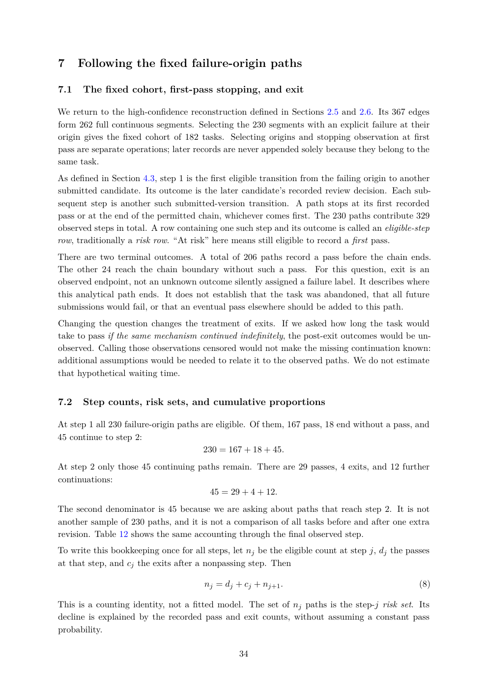

# PDF page 34



## Extracted text

```text
7     Following the fixed failure-origin paths

7.1   The fixed cohort, first-pass stopping, and exit

We return to the high-confidence reconstruction defined in Sections 2.5 and 2.6. Its 367 edges
form 262 full continuous segments. Selecting the 230 segments with an explicit failure at their
origin gives the fixed cohort of 182 tasks. Selecting origins and stopping observation at first
pass are separate operations; later records are never appended solely because they belong to the
same task.
As defined in Section 4.3, step 1 is the first eligible transition from the failing origin to another
submitted candidate. Its outcome is the later candidate’s recorded review decision. Each sub-
sequent step is another such submitted-version transition. A path stops at its first recorded
pass or at the end of the permitted chain, whichever comes first. The 230 paths contribute 329
observed steps in total. A row containing one such step and its outcome is called an eligible-step
row, traditionally a risk row. “At risk” here means still eligible to record a first pass.
There are two terminal outcomes. A total of 206 paths record a pass before the chain ends.
The other 24 reach the chain boundary without such a pass. For this question, exit is an
observed endpoint, not an unknown outcome silently assigned a failure label. It describes where
this analytical path ends. It does not establish that the task was abandoned, that all future
submissions would fail, or that an eventual pass elsewhere should be added to this path.
Changing the question changes the treatment of exits. If we asked how long the task would
take to pass if the same mechanism continued indefinitely, the post-exit outcomes would be un-
observed. Calling those observations censored would not make the missing continuation known:
additional assumptions would be needed to relate it to the observed paths. We do not estimate
that hypothetical waiting time.


7.2   Step counts, risk sets, and cumulative proportions

At step 1 all 230 failure-origin paths are eligible. Of them, 167 pass, 18 end without a pass, and
45 continue to step 2:
                                       230 = 167 + 18 + 45.
At step 2 only those 45 continuing paths remain. There are 29 passes, 4 exits, and 12 further
continuations:
                                      45 = 29 + 4 + 12.
The second denominator is 45 because we are asking about paths that reach step 2. It is not
another sample of 230 paths, and it is not a comparison of all tasks before and after one extra
revision. Table 12 shows the same accounting through the final observed step.
To write this bookkeeping once for all steps, let nj be the eligible count at step j, dj the passes
at that step, and cj the exits after a nonpassing step. Then

                                       nj = dj + cj + nj+1 .                                    (8)

This is a counting identity, not a fitted model. The set of nj paths is the step-j risk set. Its
decline is explained by the recorded pass and exit counts, without assuming a constant pass
probability.

                                                34
```
