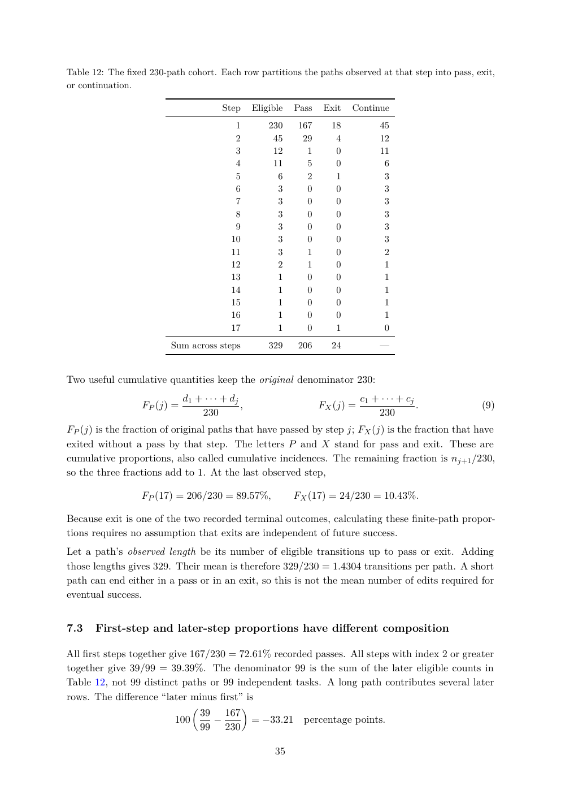

# PDF page 35



## Extracted text

```text
Table 12: The fixed 230-path cohort. Each row partitions the paths observed at that step into pass, exit,
or continuation.

                                        Step       Eligible   Pass    Exit   Continue
                                           1           230    167      18            45
                                           2            45     29       4            12
                                           3            12      1       0            11
                                           4            11      5       0             6
                                           5             6      2       1             3
                                           6             3      0       0             3
                                           7             3      0       0             3
                                           8             3      0       0             3
                                           9             3      0       0             3
                                          10             3      0       0             3
                                          11             3      1       0             2
                                          12             2      1       0             1
                                          13             1      0       0             1
                                          14             1      0       0             1
                                          15             1      0       0             1
                                          16             1      0       0             1
                                          17             1      0       1             0
                         Sum across steps              329    206      24            —


Two useful cumulative quantities keep the original denominator 230:
                             d1 + · · · + dj                                    c1 + · · · + cj
                  FP (j) =                   ,                       FX (j) =                   .   (9)
                                 230                                                230
FP (j) is the fraction of original paths that have passed by step j; FX (j) is the fraction that have
exited without a pass by that step. The letters P and X stand for pass and exit. These are
cumulative proportions, also called cumulative incidences. The remaining fraction is nj+1 /230,
so the three fractions add to 1. At the last observed step,

                  FP (17) = 206/230 = 89.57%,                 FX (17) = 24/230 = 10.43%.

Because exit is one of the two recorded terminal outcomes, calculating these finite-path propor-
tions requires no assumption that exits are independent of future success.
Let a path’s observed length be its number of eligible transitions up to pass or exit. Adding
those lengths gives 329. Their mean is therefore 329/230 = 1.4304 transitions per path. A short
path can end either in a pass or in an exit, so this is not the mean number of edits required for
eventual success.


7.3    First-step and later-step proportions have different composition

All first steps together give 167/230 = 72.61% recorded passes. All steps with index 2 or greater
together give 39/99 = 39.39%. The denominator 99 is the sum of the later eligible counts in
Table 12, not 99 distinct paths or 99 independent tasks. A long path contributes several later
rows. The difference “later minus first” is
                                              
                                    39 167
                          100         −            = −33.21     percentage points.
                                    99 230

                                                         35
```
