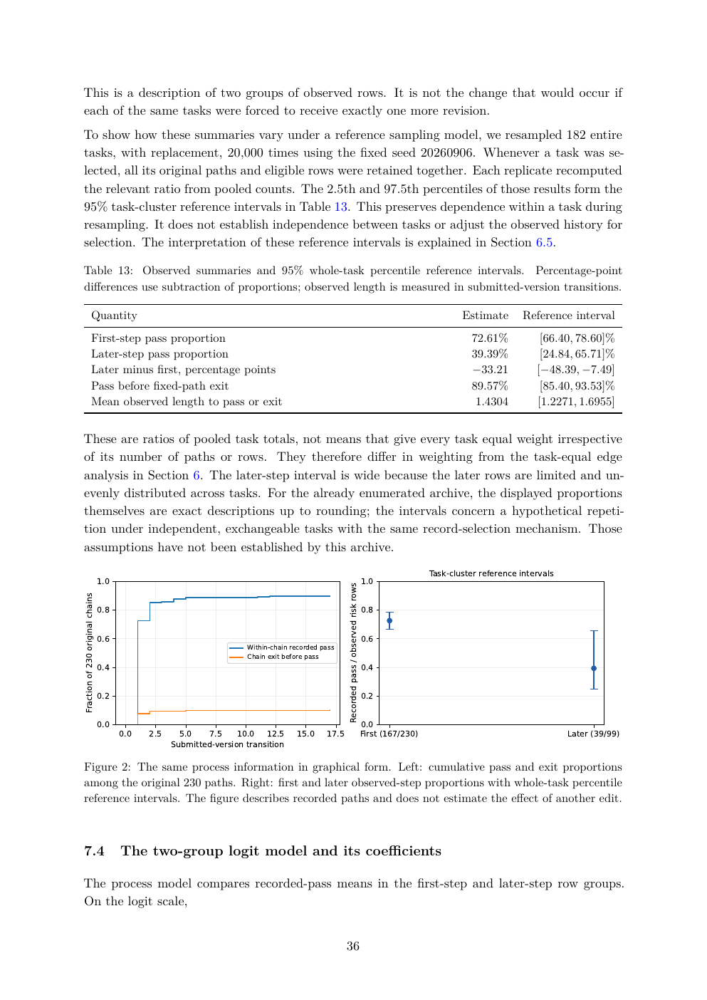

# PDF page 36



## Extracted text

```text
      This is a description of two groups of observed rows. It is not the change that would occur if
      each of the same tasks were forced to receive exactly one more revision.
      To show how these summaries vary under a reference sampling model, we resampled 182 entire
      tasks, with replacement, 20,000 times using the fixed seed 20260906. Whenever a task was se-
      lected, all its original paths and eligible rows were retained together. Each replicate recomputed
      the relevant ratio from pooled counts. The 2.5th and 97.5th percentiles of those results form the
      95% task-cluster reference intervals in Table 13. This preserves dependence within a task during
      resampling. It does not establish independence between tasks or adjust the observed history for
      selection. The interpretation of these reference intervals is explained in Section 6.5.

      Table 13: Observed summaries and 95% whole-task percentile reference intervals. Percentage-point
      differences use subtraction of proportions; observed length is measured in submitted-version transitions.

                     Quantity                                                                                                                               Estimate       Reference interval
                     First-step pass proportion                                                                                                               72.61%            [66.40, 78.60]%
                     Later-step pass proportion                                                                                                               39.39%            [24.84, 65.71]%
                     Later minus first, percentage points                                                                                                      −33.21           [−48.39, −7.49]
                     Pass before fixed-path exit                                                                                                               89.57%            [85.40, 93.53]%
                     Mean observed length to pass or exit                                                                                                      1.4304          [1.2271, 1.6955]


      These are ratios of pooled task totals, not means that give every task equal weight irrespective
      of its number of paths or rows. They therefore differ in weighting from the task-equal edge
      analysis in Section 6. The later-step interval is wide because the later rows are limited and un-
      evenly distributed across tasks. For the already enumerated archive, the displayed proportions
      themselves are exact descriptions up to rounding; the intervals concern a hypothetical repeti-
      tion under independent, exchangeable tasks with the same record-selection mechanism. Those
      assumptions have not been established by this archive.
                                                                                                                                                    Task-cluster reference intervals
                                  1.0                                                                                             1.0
                                                                                             Recorded pass / observed risk rows
Fraction of 230 original chains


                                  0.8                                                                                             0.8

                                  0.6                                                                                             0.6
                                                                Within-chain recorded pass
                                                                Chain exit before pass
                                  0.4                                                                                             0.4

                                  0.2                                                                                             0.2

                                  0.0                                                                                             0.0
                                        0.0   2.5     5.0 7.5 10.0 12.5 15.0 17.5                                                 First (167/230)                                      Later (39/99)
                                                    Submitted-version transition
       Figure 2: The same process information in graphical form. Left: cumulative pass and exit proportions
       among the original 230 paths. Right: first and later observed-step proportions with whole-task percentile
       reference intervals. The figure describes recorded paths and does not estimate the effect of another edit.


       7.4                              The two-group logit model and its coefficients

      The process model compares recorded-pass means in the first-step and later-step row groups.
      On the logit scale,


                                                                                                  36
```
