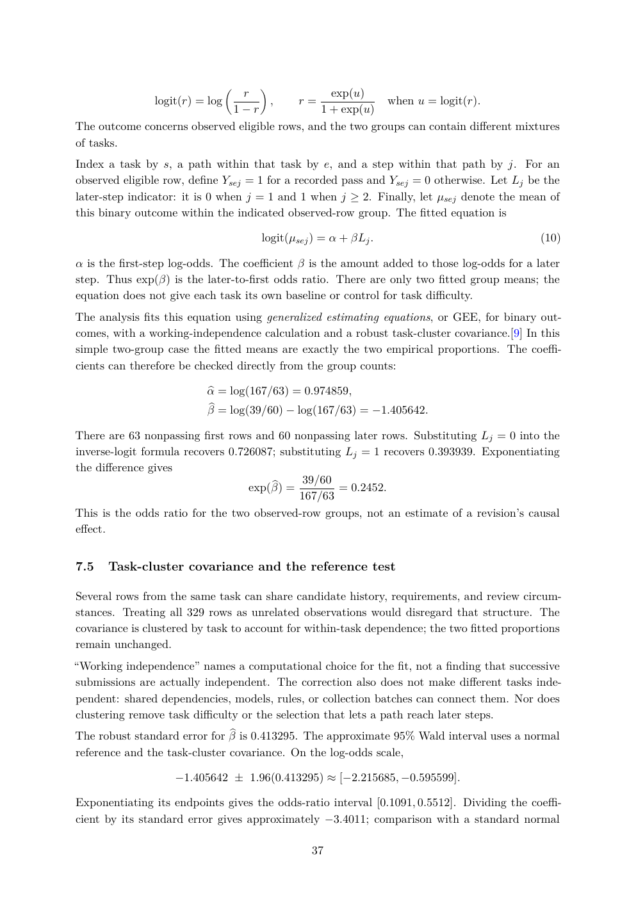

# PDF page 37



## Extracted text

```text
                                      
                                     r               exp(u)
               logit(r) = log           ,     r=                  when u = logit(r).
                                    1−r            1 + exp(u)
The outcome concerns observed eligible rows, and the two groups can contain different mixtures
of tasks.
Index a task by s, a path within that task by e, and a step within that path by j. For an
observed eligible row, define Ysej = 1 for a recorded pass and Ysej = 0 otherwise. Let Lj be the
later-step indicator: it is 0 when j = 1 and 1 when j ≥ 2. Finally, let µsej denote the mean of
this binary outcome within the indicated observed-row group. The fitted equation is

                                       logit(µsej ) = α + βLj .                            (10)

α is the first-step log-odds. The coefficient β is the amount added to those log-odds for a later
step. Thus exp(β) is the later-to-first odds ratio. There are only two fitted group means; the
equation does not give each task its own baseline or control for task difficulty.
The analysis fits this equation using generalized estimating equations, or GEE, for binary out-
comes, with a working-independence calculation and a robust task-cluster covariance.[9] In this
simple two-group case the fitted means are exactly the two empirical proportions. The coeffi-
cients can therefore be checked directly from the group counts:

                         b = log(167/63) = 0.974859,
                         α
                          βb = log(39/60) − log(167/63) = −1.405642.

There are 63 nonpassing first rows and 60 nonpassing later rows. Substituting Lj = 0 into the
inverse-logit formula recovers 0.726087; substituting Lj = 1 recovers 0.393939. Exponentiating
the difference gives
                                       b = 39/60 = 0.2452.
                                   exp(β)
                                            167/63
This is the odds ratio for the two observed-row groups, not an estimate of a revision’s causal
effect.


7.5   Task-cluster covariance and the reference test

Several rows from the same task can share candidate history, requirements, and review circum-
stances. Treating all 329 rows as unrelated observations would disregard that structure. The
covariance is clustered by task to account for within-task dependence; the two fitted proportions
remain unchanged.
“Working independence” names a computational choice for the fit, not a finding that successive
submissions are actually independent. The correction also does not make different tasks inde-
pendent: shared dependencies, models, rules, or collection batches can connect them. Nor does
clustering remove task difficulty or the selection that lets a path reach later steps.
The robust standard error for βb is 0.413295. The approximate 95% Wald interval uses a normal
reference and the task-cluster covariance. On the log-odds scale,

                   −1.405642 ± 1.96(0.413295) ≈ [−2.215685, −0.595599].

Exponentiating its endpoints gives the odds-ratio interval [0.1091, 0.5512]. Dividing the coeffi-
cient by its standard error gives approximately −3.4011; comparison with a standard normal

                                                 37
```
