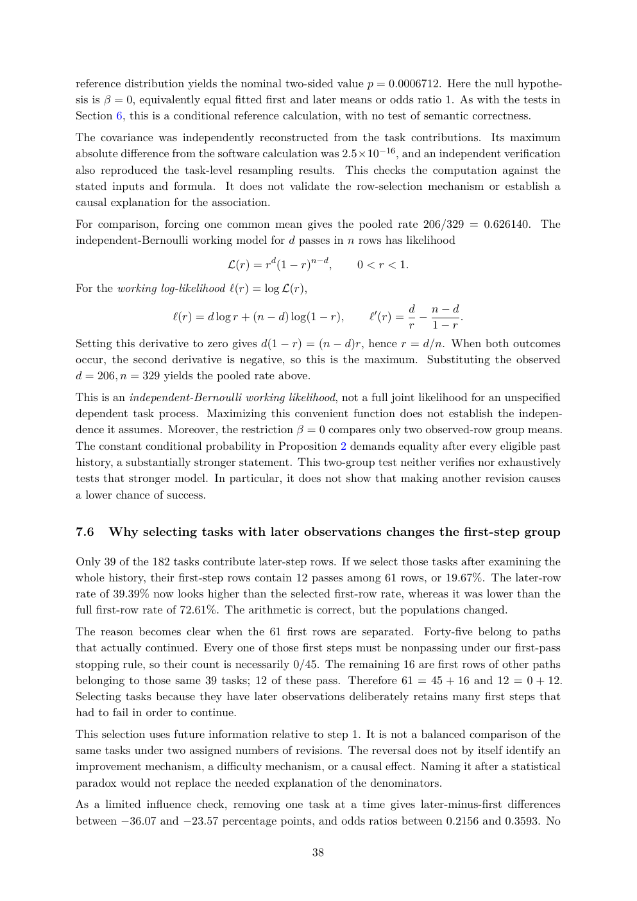

# PDF page 38



## Extracted text

```text
reference distribution yields the nominal two-sided value p = 0.0006712. Here the null hypothe-
sis is β = 0, equivalently equal fitted first and later means or odds ratio 1. As with the tests in
Section 6, this is a conditional reference calculation, with no test of semantic correctness.
The covariance was independently reconstructed from the task contributions. Its maximum
absolute difference from the software calculation was 2.5×10−16 , and an independent verification
also reproduced the task-level resampling results. This checks the computation against the
stated inputs and formula. It does not validate the row-selection mechanism or establish a
causal explanation for the association.
For comparison, forcing one common mean gives the pooled rate 206/329 = 0.626140. The
independent-Bernoulli working model for d passes in n rows has likelihood

                              L(r) = rd (1 − r)n−d ,      0 < r < 1.

For the working log-likelihood ℓ(r) = log L(r),
                                                                       d n−d
                   ℓ(r) = d log r + (n − d) log(1 − r),     ℓ′ (r) =     −     .
                                                                       r   1−r
Setting this derivative to zero gives d(1 − r) = (n − d)r, hence r = d/n. When both outcomes
occur, the second derivative is negative, so this is the maximum. Substituting the observed
d = 206, n = 329 yields the pooled rate above.
This is an independent-Bernoulli working likelihood, not a full joint likelihood for an unspecified
dependent task process. Maximizing this convenient function does not establish the indepen-
dence it assumes. Moreover, the restriction β = 0 compares only two observed-row group means.
The constant conditional probability in Proposition 2 demands equality after every eligible past
history, a substantially stronger statement. This two-group test neither verifies nor exhaustively
tests that stronger model. In particular, it does not show that making another revision causes
a lower chance of success.


7.6   Why selecting tasks with later observations changes the first-step group

Only 39 of the 182 tasks contribute later-step rows. If we select those tasks after examining the
whole history, their first-step rows contain 12 passes among 61 rows, or 19.67%. The later-row
rate of 39.39% now looks higher than the selected first-row rate, whereas it was lower than the
full first-row rate of 72.61%. The arithmetic is correct, but the populations changed.
The reason becomes clear when the 61 first rows are separated. Forty-five belong to paths
that actually continued. Every one of those first steps must be nonpassing under our first-pass
stopping rule, so their count is necessarily 0/45. The remaining 16 are first rows of other paths
belonging to those same 39 tasks; 12 of these pass. Therefore 61 = 45 + 16 and 12 = 0 + 12.
Selecting tasks because they have later observations deliberately retains many first steps that
had to fail in order to continue.
This selection uses future information relative to step 1. It is not a balanced comparison of the
same tasks under two assigned numbers of revisions. The reversal does not by itself identify an
improvement mechanism, a difficulty mechanism, or a causal effect. Naming it after a statistical
paradox would not replace the needed explanation of the denominators.
As a limited influence check, removing one task at a time gives later-minus-first differences
between −36.07 and −23.57 percentage points, and odds ratios between 0.2156 and 0.3593. No

                                                  38
```
