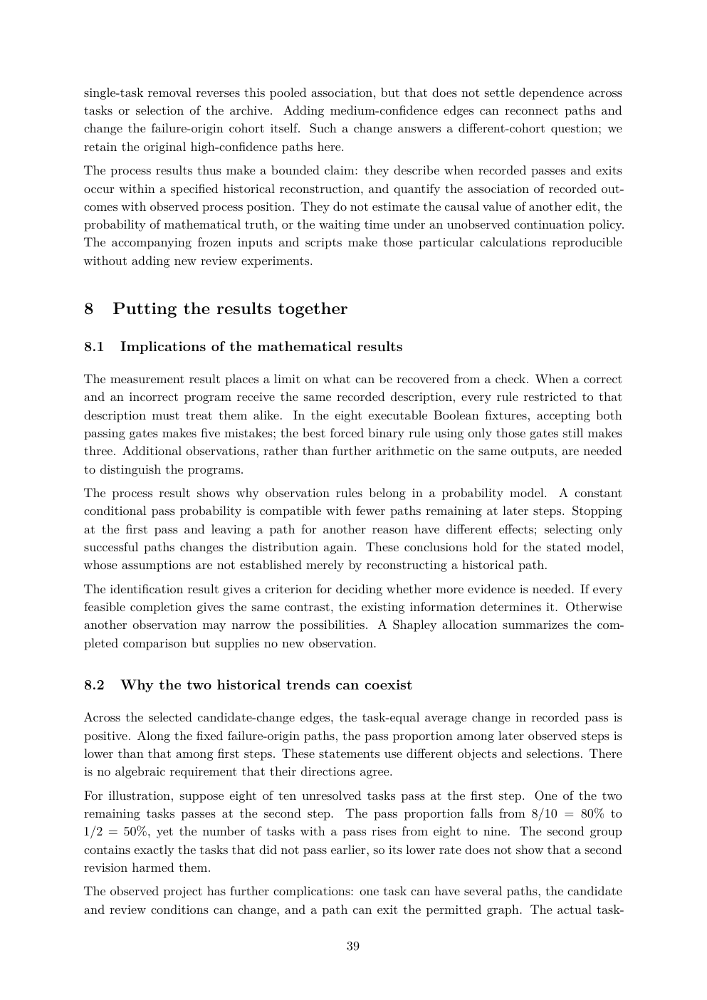

# PDF page 39



## Extracted text

```text
single-task removal reverses this pooled association, but that does not settle dependence across
tasks or selection of the archive. Adding medium-confidence edges can reconnect paths and
change the failure-origin cohort itself. Such a change answers a different-cohort question; we
retain the original high-confidence paths here.
The process results thus make a bounded claim: they describe when recorded passes and exits
occur within a specified historical reconstruction, and quantify the association of recorded out-
comes with observed process position. They do not estimate the causal value of another edit, the
probability of mathematical truth, or the waiting time under an unobserved continuation policy.
The accompanying frozen inputs and scripts make those particular calculations reproducible
without adding new review experiments.


8     Putting the results together

8.1   Implications of the mathematical results

The measurement result places a limit on what can be recovered from a check. When a correct
and an incorrect program receive the same recorded description, every rule restricted to that
description must treat them alike. In the eight executable Boolean fixtures, accepting both
passing gates makes five mistakes; the best forced binary rule using only those gates still makes
three. Additional observations, rather than further arithmetic on the same outputs, are needed
to distinguish the programs.
The process result shows why observation rules belong in a probability model. A constant
conditional pass probability is compatible with fewer paths remaining at later steps. Stopping
at the first pass and leaving a path for another reason have different effects; selecting only
successful paths changes the distribution again. These conclusions hold for the stated model,
whose assumptions are not established merely by reconstructing a historical path.
The identification result gives a criterion for deciding whether more evidence is needed. If every
feasible completion gives the same contrast, the existing information determines it. Otherwise
another observation may narrow the possibilities. A Shapley allocation summarizes the com-
pleted comparison but supplies no new observation.


8.2   Why the two historical trends can coexist

Across the selected candidate-change edges, the task-equal average change in recorded pass is
positive. Along the fixed failure-origin paths, the pass proportion among later observed steps is
lower than that among first steps. These statements use different objects and selections. There
is no algebraic requirement that their directions agree.
For illustration, suppose eight of ten unresolved tasks pass at the first step. One of the two
remaining tasks passes at the second step. The pass proportion falls from 8/10 = 80% to
1/2 = 50%, yet the number of tasks with a pass rises from eight to nine. The second group
contains exactly the tasks that did not pass earlier, so its lower rate does not show that a second
revision harmed them.
The observed project has further complications: one task can have several paths, the candidate
and review conditions can change, and a path can exit the permitted graph. The actual task-

                                                39
```
