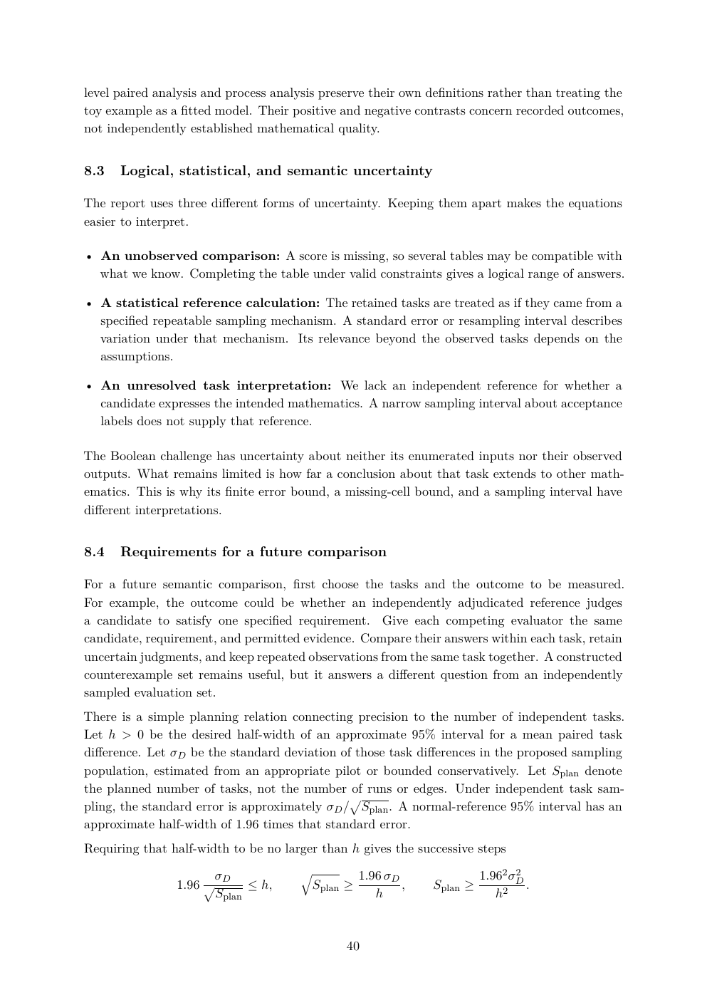

# PDF page 40



## Extracted text

```text
level paired analysis and process analysis preserve their own definitions rather than treating the
toy example as a fitted model. Their positive and negative contrasts concern recorded outcomes,
not independently established mathematical quality.


8.3   Logical, statistical, and semantic uncertainty

The report uses three different forms of uncertainty. Keeping them apart makes the equations
easier to interpret.

• An unobserved comparison: A score is missing, so several tables may be compatible with
  what we know. Completing the table under valid constraints gives a logical range of answers.

• A statistical reference calculation: The retained tasks are treated as if they came from a
  specified repeatable sampling mechanism. A standard error or resampling interval describes
  variation under that mechanism. Its relevance beyond the observed tasks depends on the
  assumptions.

• An unresolved task interpretation: We lack an independent reference for whether a
  candidate expresses the intended mathematics. A narrow sampling interval about acceptance
  labels does not supply that reference.

The Boolean challenge has uncertainty about neither its enumerated inputs nor their observed
outputs. What remains limited is how far a conclusion about that task extends to other math-
ematics. This is why its finite error bound, a missing-cell bound, and a sampling interval have
different interpretations.


8.4   Requirements for a future comparison

For a future semantic comparison, first choose the tasks and the outcome to be measured.
For example, the outcome could be whether an independently adjudicated reference judges
a candidate to satisfy one specified requirement. Give each competing evaluator the same
candidate, requirement, and permitted evidence. Compare their answers within each task, retain
uncertain judgments, and keep repeated observations from the same task together. A constructed
counterexample set remains useful, but it answers a different question from an independently
sampled evaluation set.
There is a simple planning relation connecting precision to the number of independent tasks.
Let h > 0 be the desired half-width of an approximate 95% interval for a mean paired task
difference. Let σD be the standard deviation of those task differences in the proposed sampling
population, estimated from an appropriate pilot or bounded conservatively. Let Splan denote
the planned number of tasks, not the number of runs or edges. Under independent task sam-
                                               p
pling, the standard error is approximately σD / Splan . A normal-reference 95% interval has an
approximate half-width of 1.96 times that standard error.
Requiring that half-width to be no larger than h gives the successive steps

                      σD              q             1.96 σD               1.962 σD
                                                                                 2
                1.96 p       ≤ h,         Splan ≥           ,   Splan ≥            .
                       Splan                           h                     h2


                                               40
```
