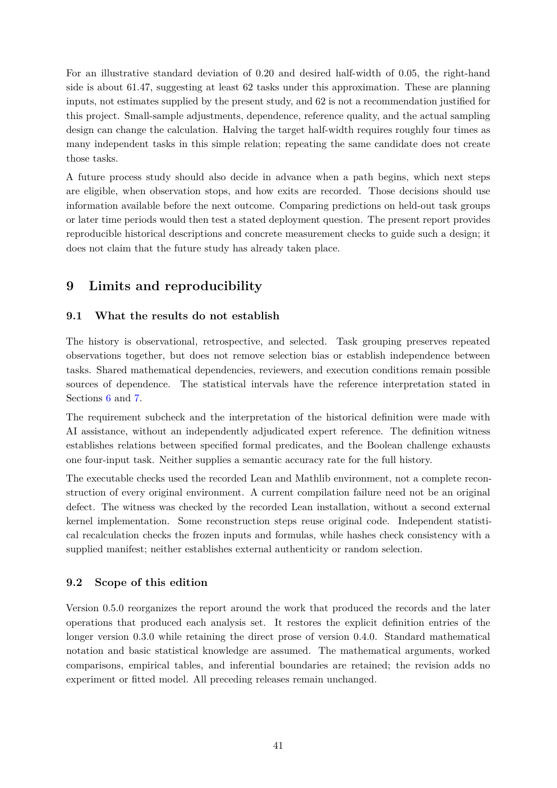

# PDF page 41



## Extracted text

```text
For an illustrative standard deviation of 0.20 and desired half-width of 0.05, the right-hand
side is about 61.47, suggesting at least 62 tasks under this approximation. These are planning
inputs, not estimates supplied by the present study, and 62 is not a recommendation justified for
this project. Small-sample adjustments, dependence, reference quality, and the actual sampling
design can change the calculation. Halving the target half-width requires roughly four times as
many independent tasks in this simple relation; repeating the same candidate does not create
those tasks.
A future process study should also decide in advance when a path begins, which next steps
are eligible, when observation stops, and how exits are recorded. Those decisions should use
information available before the next outcome. Comparing predictions on held-out task groups
or later time periods would then test a stated deployment question. The present report provides
reproducible historical descriptions and concrete measurement checks to guide such a design; it
does not claim that the future study has already taken place.


9     Limits and reproducibility

9.1   What the results do not establish

The history is observational, retrospective, and selected. Task grouping preserves repeated
observations together, but does not remove selection bias or establish independence between
tasks. Shared mathematical dependencies, reviewers, and execution conditions remain possible
sources of dependence. The statistical intervals have the reference interpretation stated in
Sections 6 and 7.
The requirement subcheck and the interpretation of the historical definition were made with
AI assistance, without an independently adjudicated expert reference. The definition witness
establishes relations between specified formal predicates, and the Boolean challenge exhausts
one four-input task. Neither supplies a semantic accuracy rate for the full history.
The executable checks used the recorded Lean and Mathlib environment, not a complete recon-
struction of every original environment. A current compilation failure need not be an original
defect. The witness was checked by the recorded Lean installation, without a second external
kernel implementation. Some reconstruction steps reuse original code. Independent statisti-
cal recalculation checks the frozen inputs and formulas, while hashes check consistency with a
supplied manifest; neither establishes external authenticity or random selection.


9.2   Scope of this edition

Version 0.5.0 reorganizes the report around the work that produced the records and the later
operations that produced each analysis set. It restores the explicit definition entries of the
longer version 0.3.0 while retaining the direct prose of version 0.4.0. Standard mathematical
notation and basic statistical knowledge are assumed. The mathematical arguments, worked
comparisons, empirical tables, and inferential boundaries are retained; the revision adds no
experiment or fitted model. All preceding releases remain unchanged.


                                              41
```
