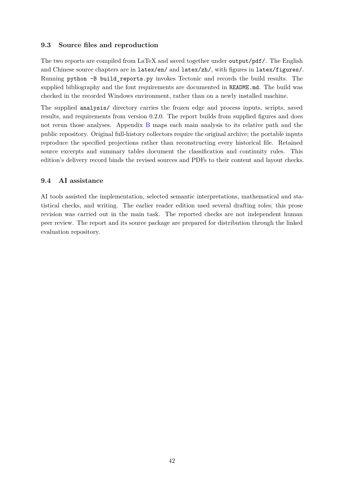

# PDF page 42



## Extracted text

```text
9.3   Source files and reproduction

The two reports are compiled from LaTeX and saved together under output/pdf/. The English
and Chinese source chapters are in latex/en/ and latex/zh/, with figures in latex/figures/.
Running python -B build_reports.py invokes Tectonic and records the build results. The
supplied bibliography and the font requirements are documented in README.md. The build was
checked in the recorded Windows environment, rather than on a newly installed machine.
The supplied analysis/ directory carries the frozen edge and process inputs, scripts, saved
results, and requirements from version 0.2.0. The report builds from supplied figures and does
not rerun those analyses. Appendix B maps each main analysis to its relative path and the
public repository. Original full-history collectors require the original archive; the portable inputs
reproduce the specified projections rather than reconstructing every historical file. Retained
source excerpts and summary tables document the classification and continuity rules. This
edition’s delivery record binds the revised sources and PDFs to their content and layout checks.


9.4   AI assistance

AI tools assisted the implementation, selected semantic interpretations, mathematical and sta-
tistical checks, and writing. The earlier reader edition used several drafting roles; this prose
revision was carried out in the main task. The reported checks are not independent human
peer review. The report and its source package are prepared for distribution through the linked
evaluation repository.


                                                 42
```
