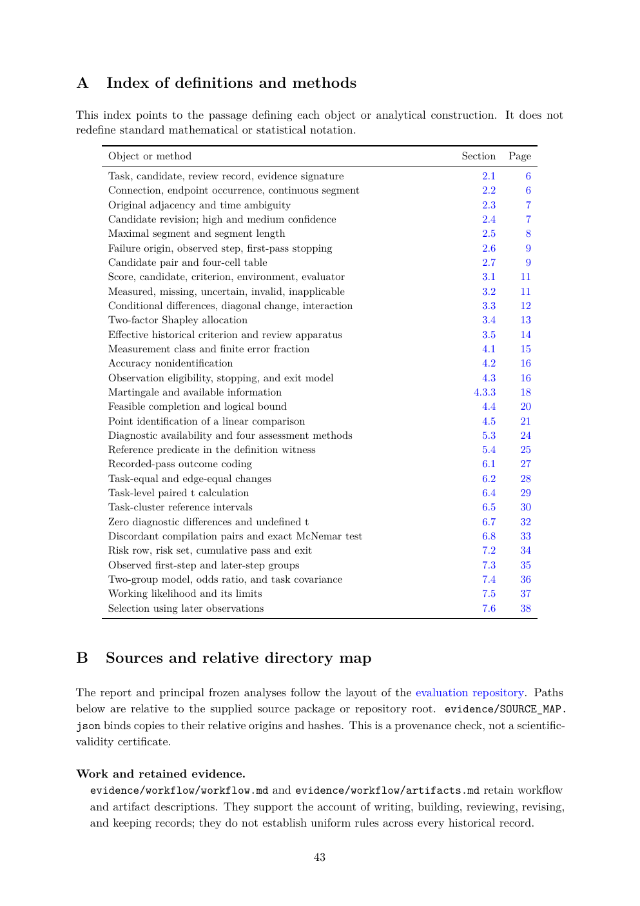

# PDF page 43



## Extracted text

```text
A     Index of definitions and methods

This index points to the passage defining each object or analytical construction. It does not
redefine standard mathematical or statistical notation.

      Object or method                                                        Section   Page
      Task, candidate, review record, evidence signature                          2.1      6
      Connection, endpoint occurrence, continuous segment                         2.2      6
      Original adjacency and time ambiguity                                       2.3      7
      Candidate revision; high and medium confidence                               2.4      7
      Maximal segment and segment length                                          2.5      8
      Failure origin, observed step, first-pass stopping                           2.6      9
      Candidate pair and four-cell table                                          2.7      9
      Score, candidate, criterion, environment, evaluator                         3.1     11
      Measured, missing, uncertain, invalid, inapplicable                         3.2     11
      Conditional differences, diagonal change, interaction                        3.3     12
      Two-factor Shapley allocation                                               3.4     13
      Effective historical criterion and review apparatus                          3.5     14
      Measurement class and finite error fraction                                  4.1     15
      Accuracy nonidentification                                                   4.2     16
      Observation eligibility, stopping, and exit model                           4.3     16
      Martingale and available information                                      4.3.3     18
      Feasible completion and logical bound                                       4.4     20
      Point identification of a linear comparison                                  4.5     21
      Diagnostic availability and four assessment methods                         5.3     24
      Reference predicate in the definition witness                                5.4     25
      Recorded-pass outcome coding                                                6.1     27
      Task-equal and edge-equal changes                                           6.2     28
      Task-level paired t calculation                                             6.4     29
      Task-cluster reference intervals                                            6.5     30
      Zero diagnostic differences and undefined t                                   6.7     32
      Discordant compilation pairs and exact McNemar test                         6.8     33
      Risk row, risk set, cumulative pass and exit                                7.2     34
      Observed first-step and later-step groups                                    7.3     35
      Two-group model, odds ratio, and task covariance                            7.4     36
      Working likelihood and its limits                                           7.5     37
      Selection using later observations                                          7.6     38


B     Sources and relative directory map

The report and principal frozen analyses follow the layout of the evaluation repository. Paths
below are relative to the supplied source package or repository root. evidence/SOURCE_MAP.
json binds copies to their relative origins and hashes. This is a provenance check, not a scientific-
validity certificate.

Work and retained evidence.
 evidence/workflow/workflow.md and evidence/workflow/artifacts.md retain workflow
 and artifact descriptions. They support the account of writing, building, reviewing, revising,
 and keeping records; they do not establish uniform rules across every historical record.

                                                43
```
