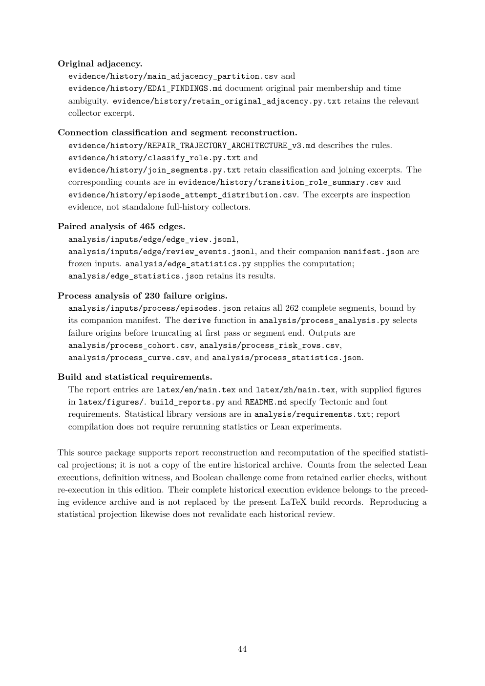

# PDF page 44



## Extracted text

```text
Original adjacency.
  evidence/history/main_adjacency_partition.csv and
  evidence/history/EDA1_FINDINGS.md document original pair membership and time
  ambiguity. evidence/history/retain_original_adjacency.py.txt retains the relevant
  collector excerpt.

Connection classification and segment reconstruction.
  evidence/history/REPAIR_TRAJECTORY_ARCHITECTURE_v3.md describes the rules.
  evidence/history/classify_role.py.txt and
  evidence/history/join_segments.py.txt retain classification and joining excerpts. The
  corresponding counts are in evidence/history/transition_role_summary.csv and
  evidence/history/episode_attempt_distribution.csv. The excerpts are inspection
  evidence, not standalone full-history collectors.

Paired analysis of 465 edges.
  analysis/inputs/edge/edge_view.jsonl,
  analysis/inputs/edge/review_events.jsonl, and their companion manifest.json are
  frozen inputs. analysis/edge_statistics.py supplies the computation;
  analysis/edge_statistics.json retains its results.

Process analysis of 230 failure origins.
  analysis/inputs/process/episodes.json retains all 262 complete segments, bound by
  its companion manifest. The derive function in analysis/process_analysis.py selects
  failure origins before truncating at first pass or segment end. Outputs are
  analysis/process_cohort.csv, analysis/process_risk_rows.csv,
  analysis/process_curve.csv, and analysis/process_statistics.json.

Build and statistical requirements.
  The report entries are latex/en/main.tex and latex/zh/main.tex, with supplied figures
  in latex/figures/. build_reports.py and README.md specify Tectonic and font
  requirements. Statistical library versions are in analysis/requirements.txt; report
  compilation does not require rerunning statistics or Lean experiments.

This source package supports report reconstruction and recomputation of the specified statisti-
cal projections; it is not a copy of the entire historical archive. Counts from the selected Lean
executions, definition witness, and Boolean challenge come from retained earlier checks, without
re-execution in this edition. Their complete historical execution evidence belongs to the preced-
ing evidence archive and is not replaced by the present LaTeX build records. Reproducing a
statistical projection likewise does not revalidate each historical review.


                                               44
```
