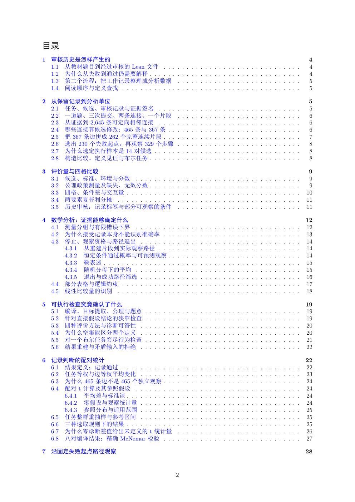

# PDF page 2



## Extracted text

```text
目录
1 审核历史是怎样产生的                                                                                             4
  1.1 从教材题目到经过审核的 Lean 文件 . . . . . . . . . . . . . . . . . . . . . . . . . . . . . .                    4
  1.2 为什么从失败到通过仍需要解释 . . . . . . . . . . . . . . . . . . . . . . . . . . . . . . . . .                   4
  1.3 第二个流程：把工作记录整理成分析数据 . . . . . . . . . . . . . . . . . . . . . . . . . . .                           5
  1.4 阅读顺序与定义查找 . . . . . . . . . . . . . . . . . . . . . . . . . . . . . . . . . . . . . . .            5

2 从保留记录到分析单位                                                                                             5
  2.1 任务、候选、审核记录与证据签名 . . . . . . . . . . . . . . . . . . . . . . . . . . . . . . .                      5
  2.2 一道题、三次提交、两条连接、一个片段 . . . . . . . . . . . . . . . . . . . . . . . . . . .                           6
  2.3 从证据到 2,645 条可定向相邻连接 . . . . . . . . . . . . . . . . . . . . . . . . . . . . . . .                  6
  2.4 哪些连接算候选修改：465 条与 367 条 . . . . . . . . . . . . . . . . . . . . . . . . . . . . .                   6
  2.5 把 367 条边拼成 262 个完整连续片段 . . . . . . . . . . . . . . . . . . . . . . . . . . . . . .                 7
  2.6 选出 230 个失败起点，再观察 329 个步骤 . . . . . . . . . . . . . . . . . . . . . . . . . . .                     8
  2.7 为什么选定执行样本是 14 对候选 . . . . . . . . . . . . . . . . . . . . . . . . . . . . . . . .                  8
  2.8 构造比较、定义见证与布尔任务 . . . . . . . . . . . . . . . . . . . . . . . . . . . . . . . . .                   8

3 评价量与四格比较                                                                                               9
  3.1 候选、标准、环境与分数 . . . . . . . . . . . . . . . . . . . . . . . . . . . . . . . . . . . .                9
  3.2 公理政策测量及缺失、无效分数 . . . . . . . . . . . . . . . . . . . . . . . . . . . . . . . . .                   9
  3.3 四格、条件差与交互量 . . . . . . . . . . . . . . . . . . . . . . . . . . . . . . . . . . . . . .            10
  3.4 两要素夏普利分摊 . . . . . . . . . . . . . . . . . . . . . . . . . . . . . . . . . . . . . . . .          11
  3.5 历史审核：记录标签与部分可观察的条件 . . . . . . . . . . . . . . . . . . . . . . . . . . .                          11

4 数学分析：证据能够确定什么                                                                                         12
  4.1 测量分组与有限错误下界 . . . . . . . . . . . . . . . . . . . . . . . . . . . . . . . . . . . .               12
  4.2 为什么接受记录本身不能识别准确率 . . . . . . . . . . . . . . . . . . . . . . . . . . . . . .                      13
  4.3 停止、观察资格与路径退出 . . . . . . . . . . . . . . . . . . . . . . . . . . . . . . . . . . .                14
      4.3.1 从重建片段到实际观察路径 . . . . . . . . . . . . . . . . . . . . . . . . . . . . . . .                  14
      4.3.2 恒定条件通过概率与可预测观察 . . . . . . . . . . . . . . . . . . . . . . . . . . . . .                    14
      4.3.3 鞅表述 . . . . . . . . . . . . . . . . . . . . . . . . . . . . . . . . . . . . . . . . . . .   15
      4.3.4 随机分母下的平均 . . . . . . . . . . . . . . . . . . . . . . . . . . . . . . . . . . . .            15
      4.3.5 退出与成功路径筛选 . . . . . . . . . . . . . . . . . . . . . . . . . . . . . . . . . . .             16
  4.4 部分表格与逻辑约束 . . . . . . . . . . . . . . . . . . . . . . . . . . . . . . . . . . . . . . .           17
  4.5 线性比较量的识别 . . . . . . . . . . . . . . . . . . . . . . . . . . . . . . . . . . . . . . . .          18

5 可执行检查究竟确认了什么                                                                                          19
  5.1 编译、目标提取、公理与题意 . . . . . . . . . . . . . . . . . . . . . . . . . . . . . . . . . .                 19
  5.2 针对直接假设结论的狭窄检查 . . . . . . . . . . . . . . . . . . . . . . . . . . . . . . . . . .                 19
  5.3 四种评价方法与诊断可答性 . . . . . . . . . . . . . . . . . . . . . . . . . . . . . . . . . . .                20
  5.4 为什么空集能区分两个定义 . . . . . . . . . . . . . . . . . . . . . . . . . . . . . . . . . . .                20
  5.5 对一个布尔任务穷尽行为检查 . . . . . . . . . . . . . . . . . . . . . . . . . . . . . . . . . .                 21
  5.6 结果重建与矛盾输入的拒绝 . . . . . . . . . . . . . . . . . . . . . . . . . . . . . . . . . . .                22

6 记录判断的配对统计                                                                                             22
  6.1 结果定义：记录通过 . . . . . . . . . . . . . . . . . . . . . . . . . . . . . . . . . . . . . . .           22
  6.2 任务等权与边等权平均变化 . . . . . . . . . . . . . . . . . . . . . . . . . . . . . . . . . . .                23
  6.3 为什么 465 条边不是 465 个独立观察 . . . . . . . . . . . . . . . . . . . . . . . . . . . . . .                24
  6.4 配对 t 计算及其参照假设 . . . . . . . . . . . . . . . . . . . . . . . . . . . . . . . . . . . .             24
      6.4.1 平均差与标准误 . . . . . . . . . . . . . . . . . . . . . . . . . . . . . . . . . . . . . .         24
      6.4.2 零假设与观察统计量 . . . . . . . . . . . . . . . . . . . . . . . . . . . . . . . . . . .             24
      6.4.3 参照分布与适用范围 . . . . . . . . . . . . . . . . . . . . . . . . . . . . . . . . . . .             25
  6.5 任务整群重抽样与参考区间 . . . . . . . . . . . . . . . . . . . . . . . . . . . . . . . . . . .                25
  6.6 三种选取规则下的结果 . . . . . . . . . . . . . . . . . . . . . . . . . . . . . . . . . . . . . .            25
  6.7 为什么零诊断差值给出未定义的 t 统计量 . . . . . . . . . . . . . . . . . . . . . . . . . . .                        26
  6.8 八对编译结果：精确 McNemar 检验 . . . . . . . . . . . . . . . . . . . . . . . . . . . . . .                  27

7 沿固定失败起点路径观察                                                                                           28


                                                    2
```
