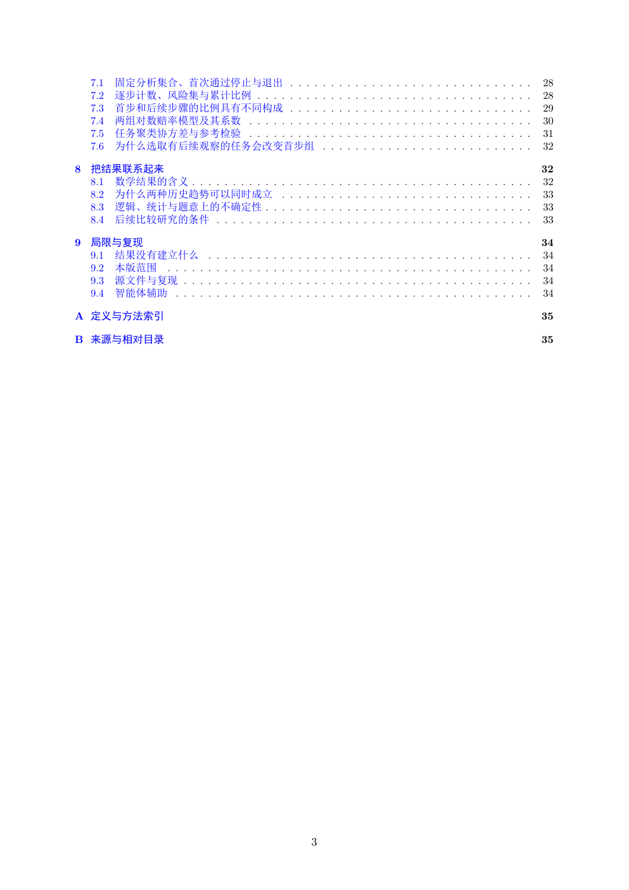

# PDF page 3



## Extracted text

```text
   7.1   固定分析集合、首次通过停止与退出 . . . . . . . . . . . . . . . . . . . . . . . . . . . . . .                  28
   7.2   逐步计数、风险集与累计比例 . . . . . . . . . . . . . . . . . . . . . . . . . . . . . . . . . .             28
   7.3   首步和后续步骤的比例具有不同构成 . . . . . . . . . . . . . . . . . . . . . . . . . . . . . .                  29
   7.4   两组对数赔率模型及其系数 . . . . . . . . . . . . . . . . . . . . . . . . . . . . . . . . . . .            30
   7.5   任务聚类协方差与参考检验 . . . . . . . . . . . . . . . . . . . . . . . . . . . . . . . . . . .            31
   7.6   为什么选取有后续观察的任务会改变首步组 . . . . . . . . . . . . . . . . . . . . . . . . . .                       32

8 把结果联系起来                                                                                              32
  8.1 数学结果的含义 . . . . . . . . . . . . . . . . . . . . . . . . . . . . . . . . . . . . . . . . . .      32
  8.2 为什么两种历史趋势可以同时成立 . . . . . . . . . . . . . . . . . . . . . . . . . . . . . . .                    33
  8.3 逻辑、统计与题意上的不确定性 . . . . . . . . . . . . . . . . . . . . . . . . . . . . . . . . .                 33
  8.4 后续比较研究的条件 . . . . . . . . . . . . . . . . . . . . . . . . . . . . . . . . . . . . . . .          33

9 局限与复现                                                                                                34
  9.1 结果没有建立什么 . . . . . . . . . . . . . . . . . . . . . . . . . . . . . . . . . . . . . . . .         34
  9.2 本版范围 . . . . . . . . . . . . . . . . . . . . . . . . . . . . . . . . . . . . . . . . . . . . .   34
  9.3 源文件与复现 . . . . . . . . . . . . . . . . . . . . . . . . . . . . . . . . . . . . . . . . . . .     34
  9.4 智能体辅助 . . . . . . . . . . . . . . . . . . . . . . . . . . . . . . . . . . . . . . . . . . . .    34

A 定义与方法索引                                                                                              35

B 来源与相对目录                                                                                              35


                                                   3
```
