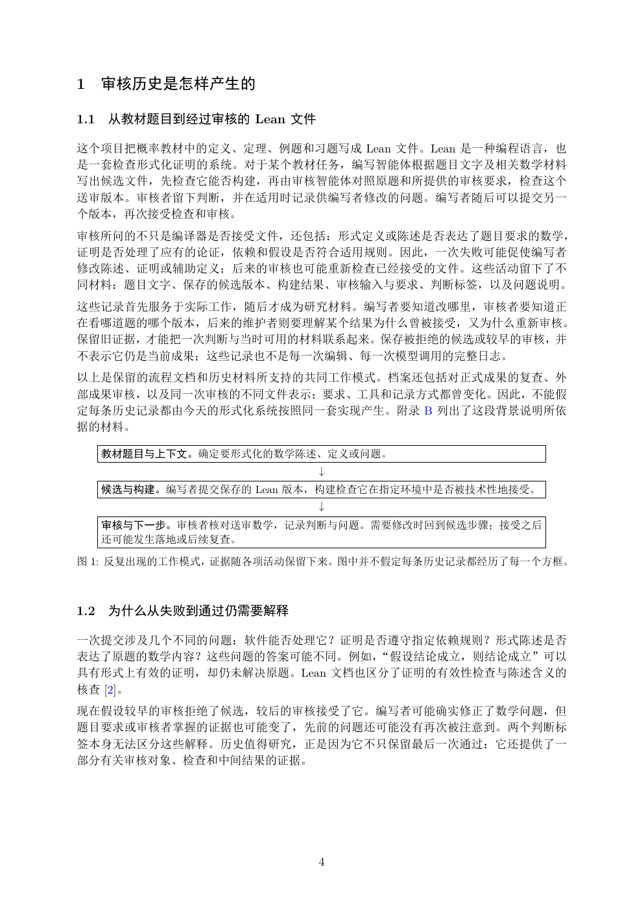

# PDF page 4



## Extracted text

```text
1 审核历史是怎样产生的

1.1   从教材题目到经过审核的 Lean 文件

这个项目把概率教材中的定义、定理、例题和习题写成 Lean 文件。Lean 是一种编程语言，也
是一套检查形式化证明的系统。对于某个教材任务，编写智能体根据题目文字及相关数学材料
写出候选文件，先检查它能否构建，再由审核智能体对照原题和所提供的审核要求，检查这个
送审版本。审核者留下判断，并在适用时记录供编写者修改的问题。编写者随后可以提交另一
个版本，再次接受检查和审核。
审核所问的不只是编译器是否接受文件，还包括：形式定义或陈述是否表达了题目要求的数学，
证明是否处理了应有的论证，依赖和假设是否符合适用规则。因此，一次失败可能促使编写者
修改陈述、证明或辅助定义；后来的审核也可能重新检查已经接受的文件。这些活动留下了不
同材料：题目文字、保存的候选版本、构建结果、审核输入与要求、判断标签，以及问题说明。
这些记录首先服务于实际工作，随后才成为研究材料。编写者要知道改哪里，审核者要知道正
在看哪道题的哪个版本，后来的维护者则要理解某个结果为什么曾被接受，又为什么重新审核。
保留旧证据，才能把一次判断与当时可用的材料联系起来。保存被拒绝的候选或较早的审核，并
不表示它仍是当前成果；这些记录也不是每一次编辑、每一次模型调用的完整日志。
以上是保留的流程文档和历史材料所支持的共同工作模式。档案还包括对正式成果的复查、外
部成果审核，以及同一次审核的不同文件表示；要求、工具和记录方式都曾变化。因此，不能假
定每条历史记录都由今天的形式化系统按照同一套实现产生。附录 B 列出了这段背景说明所依
据的材料。

      教材题目与上下文。确定要形式化的数学陈述、定义或问题。
                            ↓
      候选与构建。编写者提交保存的 Lean 版本，构建检查它在指定环境中是否被技术性地接受。
                            ↓
      审核与下一步。审核者核对送审数学，记录判断与问题。需要修改时回到候选步骤；接受之后
      还可能发生落地或后续复查。

图 1: 反复出现的工作模式，证据随各项活动保留下来。图中并不假定每条历史记录都经历了每一个方框。


1.2   为什么从失败到通过仍需要解释

一次提交涉及几个不同的问题：软件能否处理它？证明是否遵守指定依赖规则？形式陈述是否
表达了原题的数学内容？这些问题的答案可能不同。例如，“假设结论成立，则结论成立”可以
具有形式上有效的证明，却仍未解决原题。Lean 文档也区分了证明的有效性检查与陈述含义的
核查 [2]。
现在假设较早的审核拒绝了候选，较后的审核接受了它。编写者可能确实修正了数学问题，但
题目要求或审核者掌握的证据也可能变了，先前的问题还可能没有再次被注意到。两个判断标
签本身无法区分这些解释。历史值得研究，正是因为它不只保留最后一次通过：它还提供了一
部分有关审核对象、检查和中间结果的证据。


                            4
```
