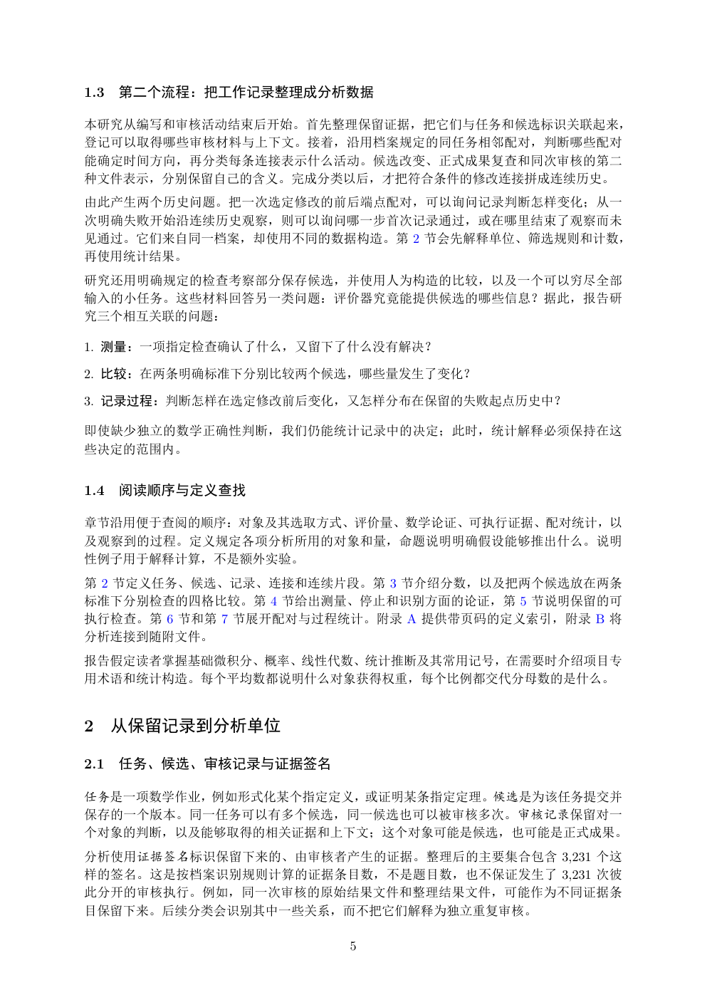

# PDF page 5



## Extracted text

```text
1.3   第二个流程：把工作记录整理成分析数据

本研究从编写和审核活动结束后开始。首先整理保留证据，把它们与任务和候选标识关联起来，
登记可以取得哪些审核材料与上下文。接着，沿用档案规定的同任务相邻配对，判断哪些配对
能确定时间方向，再分类每条连接表示什么活动。候选改变、正式成果复查和同次审核的第二
种文件表示，分别保留自己的含义。完成分类以后，才把符合条件的修改连接拼成连续历史。
由此产生两个历史问题。把一次选定修改的前后端点配对，可以询问记录判断怎样变化；从一
次明确失败开始沿连续历史观察，则可以询问哪一步首次记录通过，或在哪里结束了观察而未
见通过。它们来自同一档案，却使用不同的数据构造。第 2 节会先解释单位、筛选规则和计数，
再使用统计结果。
研究还用明确规定的检查考察部分保存候选，并使用人为构造的比较，以及一个可以穷尽全部
输入的小任务。这些材料回答另一类问题：评价器究竟能提供候选的哪些信息？据此，报告研
究三个相互关联的问题：

1. 测量：一项指定检查确认了什么，又留下了什么没有解决？

2. 比较：在两条明确标准下分别比较两个候选，哪些量发生了变化？

3. 记录过程：判断怎样在选定修改前后变化，又怎样分布在保留的失败起点历史中？

即使缺少独立的数学正确性判断，我们仍能统计记录中的决定；此时，统计解释必须保持在这
些决定的范围内。


1.4   阅读顺序与定义查找

章节沿用便于查阅的顺序：对象及其选取方式、评价量、数学论证、可执行证据、配对统计，以
及观察到的过程。定义规定各项分析所用的对象和量，命题说明明确假设能够推出什么。说明
性例子用于解释计算，不是额外实验。
第 2 节定义任务、候选、记录、连接和连续片段。第 3 节介绍分数，以及把两个候选放在两条
标准下分别检查的四格比较。第 4 节给出测量、停止和识别方面的论证，第 5 节说明保留的可
执行检查。第 6 节和第 7 节展开配对与过程统计。附录 A 提供带页码的定义索引，附录 B 将
分析连接到随附文件。
报告假定读者掌握基础微积分、概率、线性代数、统计推断及其常用记号，在需要时介绍项目专
用术语和统计构造。每个平均数都说明什么对象获得权重，每个比例都交代分母数的是什么。


2 从保留记录到分析单位

2.1   任务、候选、审核记录与证据签名

任务是一项数学作业，例如形式化某个指定定义，或证明某条指定定理。候选是为该任务提交并
保存的一个版本。同一任务可以有多个候选，同一候选也可以被审核多次。审核记录保留对一
个对象的判断，以及能够取得的相关证据和上下文；这个对象可能是候选，也可能是正式成果。
分析使用证据签名标识保留下来的、由审核者产生的证据。整理后的主要集合包含 3,231 个这
样的签名。这是按档案识别规则计算的证据条目数，不是题目数，也不保证发生了 3,231 次彼
此分开的审核执行。例如，同一次审核的原始结果文件和整理结果文件，可能作为不同证据条
目保留下来。后续分类会识别其中一些关系，而不把它们解释为独立重复审核。

                        5
```
