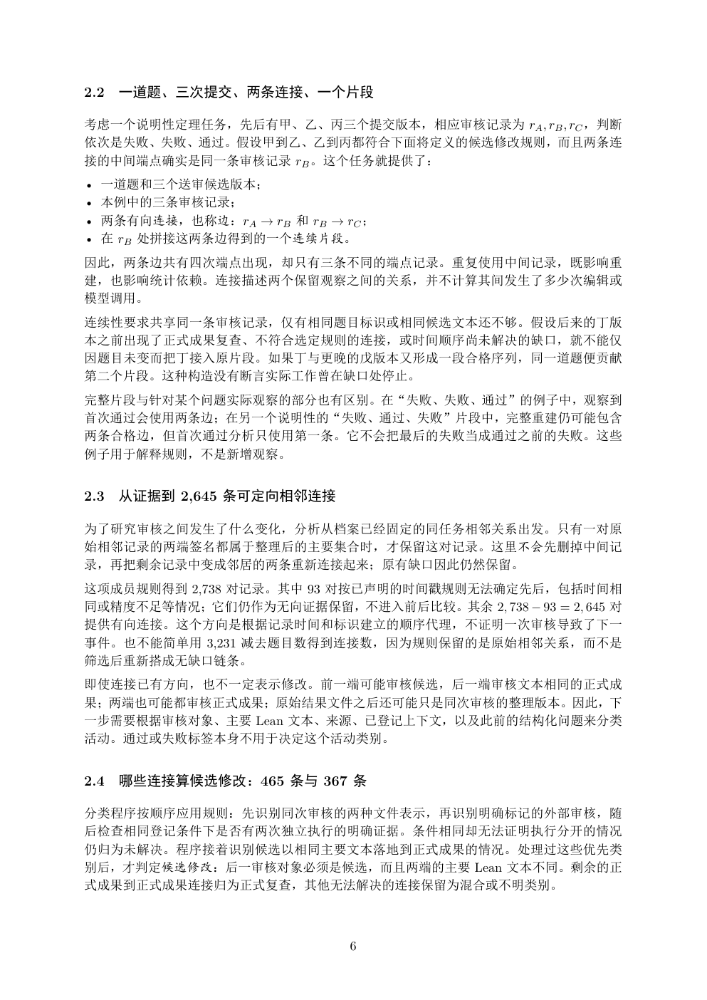

# PDF page 6



## Extracted text

```text
2.2   一道题、三次提交、两条连接、一个片段

考虑一个说明性定理任务，先后有甲、乙、丙三个提交版本，相应审核记录为 rA , rB , rC ，判断
依次是失败、失败、通过。假设甲到乙、乙到丙都符合下面将定义的候选修改规则，而且两条连
接的中间端点确实是同一条审核记录 rB 。这个任务就提供了：
• 一道题和三个送审候选版本；
• 本例中的三条审核记录；
• 两条有向连接，也称边：rA → rB 和 rB → rC ；
• 在 rB 处拼接这两条边得到的一个连续片段。
因此，两条边共有四次端点出现，却只有三条不同的端点记录。重复使用中间记录，既影响重
建，也影响统计依赖。连接描述两个保留观察之间的关系，并不计算其间发生了多少次编辑或
模型调用。
连续性要求共享同一条审核记录，仅有相同题目标识或相同候选文本还不够。假设后来的丁版
本之前出现了正式成果复查、不符合选定规则的连接，或时间顺序尚未解决的缺口，就不能仅
因题目未变而把丁接入原片段。如果丁与更晚的戊版本又形成一段合格序列，同一道题便贡献
第二个片段。这种构造没有断言实际工作曾在缺口处停止。
完整片段与针对某个问题实际观察的部分也有区别。在“失败、失败、通过”的例子中，观察到
首次通过会使用两条边；在另一个说明性的“失败、通过、失败”片段中，完整重建仍可能包含
两条合格边，但首次通过分析只使用第一条。它不会把最后的失败当成通过之前的失败。这些
例子用于解释规则，不是新增观察。


2.3   从证据到 2,645 条可定向相邻连接

为了研究审核之间发生了什么变化，分析从档案已经固定的同任务相邻关系出发。只有一对原
始相邻记录的两端签名都属于整理后的主要集合时，才保留这对记录。这里不会先删掉中间记
录，再把剩余记录中变成邻居的两条重新连接起来；原有缺口因此仍然保留。
这项成员规则得到 2,738 对记录。其中 93 对按已声明的时间戳规则无法确定先后，包括时间相
同或精度不足等情况；它们仍作为无向证据保留，不进入前后比较。其余 2, 738 − 93 = 2, 645 对
提供有向连接。这个方向是根据记录时间和标识建立的顺序代理，不证明一次审核导致了下一
事件。也不能简单用 3,231 减去题目数得到连接数，因为规则保留的是原始相邻关系，而不是
筛选后重新搭成无缺口链条。
即使连接已有方向，也不一定表示修改。前一端可能审核候选，后一端审核文本相同的正式成
果；两端也可能都审核正式成果；原始结果文件之后还可能只是同次审核的整理版本。因此，下
一步需要根据审核对象、主要 Lean 文本、来源、已登记上下文，以及此前的结构化问题来分类
活动。通过或失败标签本身不用于决定这个活动类别。


2.4   哪些连接算候选修改：465 条与 367 条

分类程序按顺序应用规则：先识别同次审核的两种文件表示，再识别明确标记的外部审核，随
后检查相同登记条件下是否有两次独立执行的明确证据。条件相同却无法证明执行分开的情况
仍归为未解决。程序接着识别候选以相同主要文本落地到正式成果的情况。处理过这些优先类
别后，才判定候选修改：后一审核对象必须是候选，而且两端的主要 Lean 文本不同。剩余的正
式成果到正式成果连接归为正式复查，其他无法解决的连接保留为混合或不明类别。


                             6
```
