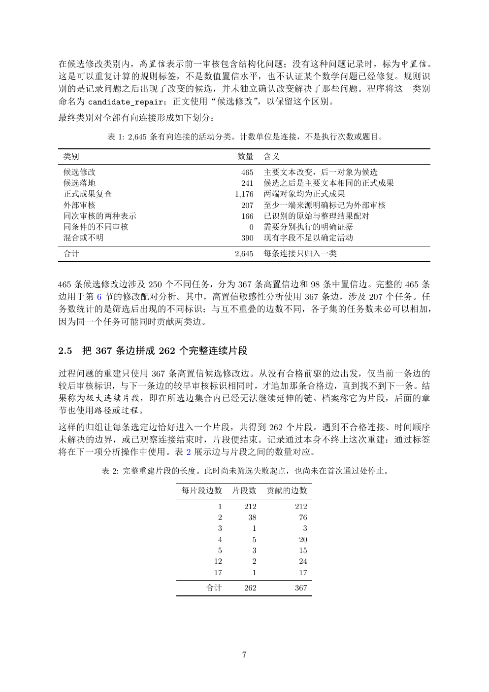

# PDF page 7



## Extracted text

```text
在候选修改类别内，高置信表示前一审核包含结构化问题；没有这种问题记录时，标为中置信。
这是可以重复计算的规则标签，不是数值置信水平，也不认证某个数学问题已经修复。规则识
别的是记录问题之后出现了改变的候选，并未独立确认改变解决了那些问题。程序将这一类别
命名为 candidate_repair；正文使用“候选修改”，以保留这个区别。
最终类别对全部有向连接形成如下划分：

         表 1: 2,645 条有向连接的活动分类。计数单位是连接，不是执行次数或题目。

 类别                          数量      含义
 候选修改                          465   主要文本改变，后一对象为候选
 候选落地                          241   候选之后是主要文本相同的正式成果
 正式成果复查                      1,176   两端对象均为正式成果
 外部审核                          207   至少一端来源明确标记为外部审核
 同次审核的两种表示                     166   已识别的原始与整理结果配对
 同条件的不同审核                        0   需要分别执行的明确证据
 混合或不明                         390   现有字段不足以确定活动
 合计                          2,645   每条连接只归入一类


465 条候选修改边涉及 250 个不同任务，分为 367 条高置信边和 98 条中置信边。完整的 465 条
边用于第 6 节的修改配对分析。其中，高置信敏感性分析使用 367 条边，涉及 207 个任务。任
务数统计的是筛选后出现的不同标识；与互不重叠的边数不同，各子集的任务数未必可以相加，
因为同一个任务可能同时贡献两类边。


2.5   把 367 条边拼成 262 个完整连续片段

过程问题的重建只使用 367 条高置信候选修改边。从没有合格前驱的边出发，仅当前一条边的
较后审核标识，与下一条边的较早审核标识相同时，才追加那条合格边，直到找不到下一条。结
果称为极大连续片段，即在所选边集合内已经无法继续延伸的链。档案称它为片段，后面的章
节也使用路径或过程。
这样的归组让每条选定边恰好进入一个片段，共得到 262 个片段。遇到不合格连接、时间顺序
未解决的边界，或已观察连接结束时，片段便结束。记录通过本身不终止这次重建：通过标签
将在下一项分析操作中使用。表 2 展示边与片段之间的数量对应。

        表 2: 完整重建片段的长度。此时尚未筛选失败起点，也尚未在首次通过处停止。

                   每片段边数     片段数     贡献的边数
                         1     212        212
                         2      38         76
                         3       1          3
                         4       5         20
                         5       3         15
                        12       2         24
                        17       1         17
                       合计      262        367


                              7
```
